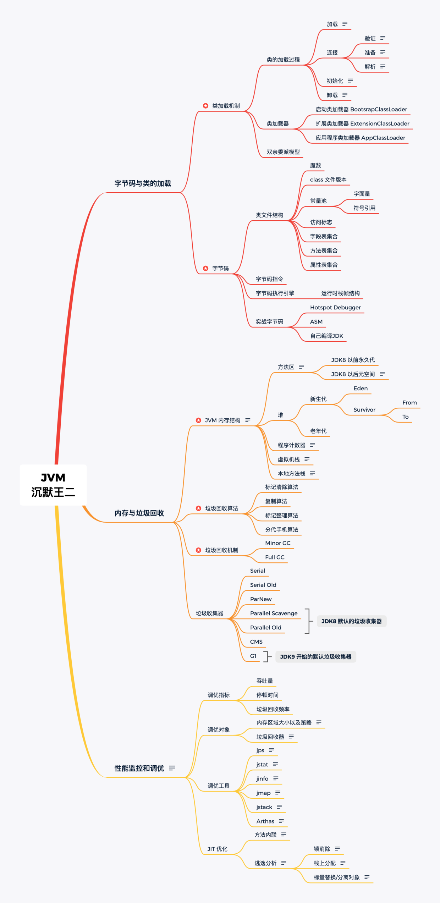

## Q&A
### 1. 在学习JVM之前，要先学并发编程吗？

概述：可以将JVM分成三层
1. Class Loader Subsystem，类加载子系统
2. 运行时数据区，chap03～10 + chap12（String在不同JDK版本中有变化）
3. 执行引擎
   1. 解释器
   2. 即时编译器
   3. 垃圾回收

第二部分：垃圾回收
1. 算法：如何判断是否为垃圾
2. 垃圾回收器，未来发展方向


## 为什么要学习JVM？
> 如果你想成为公司不可或缺的顶梁柱，那 JVM 你得学，因为一般情况下，遇到的问题基本上 Google 下就能解决了，可一旦遇到 JVM 性能调优，就必须得有能查 OOM 的原因、能看懂字节码的老鸟出马了。
> 
> 应用程序一旦上线，出问题是板上钉钉的事，除了数据库、网络、代码逻辑上的问题，剩下的就有内存溢出啊，频繁 GC 导致的性能瓶颈啊等棘手问题。
> 
> 遇到这种问题，你就必须得能看懂 GC 日志，明白什么是老年代、永久代、元数据区等，这些都是 Java 虚拟机方面的知识。


## JVM的学习思路
三大部分:
1. 字节码与类的加载、
2. 内存与垃圾回收、
3. 性能监控和调优。



## Reference
* [沉默王二: 二哥的Java进阶之路x沉默王二](https://javabetter.cn/home.html#%E4%B8%BA%E4%BB%80%E4%B9%88%E4%BC%9A%E6%9C%89%E8%BF%99%E4%B8%AA%E5%BC%80%E6%BA%90%E7%9F%A5%E8%AF%86%E5%BA%93)
* [沉默王二: 2024年最值得收藏的JVM学习路线](https://javabetter.cn/xuexiluxian/java/jvm.html)
* [Medium: Understanding JVM Architecture](https://medium.com/platform-engineer/understanding-jvm-architecture-22c0ddf09722)
* [20张图助你了解JVM运行时数据区，你还觉得枯燥吗？](https://cloud.tencent.com/developer/article/1823397)
* [哲雪君！: JVM学习笔记](https://www.cnblogs.com/zhexuejun/category/2045472.html)


## Initialize Repository and Setup
1. Create a new repository on the command line
   ```shell
   echo "# JVMTutorial" >> README.md
   git init
   git add README.md
   git commit -m "first commit"
   git branch -M main
   git remote add origin git@github.com:ylqi007/JVMTutorial.git
   git push -u origin main
   ```
2. Push an existing repository from the command line
   ```shell
   git remote add origin git@github.com:ylqi007/JVMTutorial.git
   git branch -M main
   git push -u origin main
   ```
3. Import code from another repository 
   * You can initialize this repository with code from a Subversion, Mercurial, or TFS project.


## 添加新Module之后
如果因为JDK版本问题而编译失败，需要调整以下两个地方
1. Settings -> Build, Execution, Deployment -> Compiler -> Java Compiler -> Target bytecode version
   * 将Target bytecode version修改为指定的版本
2. Project Structure -> Modules -> <Specific Module> -> Sources/Dependencies
   * 将Sources/Depedencies选择为指定的版本


## Reference
* ✅ B站: [尚硅谷JVM全套教程，百万播放，全网巅峰（宋红康详解java虚拟机）](https://www.bilibili.com/video/BV1PJ411n7xZ)
  * ✅ [JVM从入门到精通](https://www.yuque.com/u21195183/jvm)
  * https://github.com/vectorxxxx/NOTE_JVM
* https://github.com/youthlql/JavaYouth?tab=readme-ov-file
* 
* 参考书目
  * JDK 官方：[Java Language and Virtual Machine Specifications](https://docs.oracle.com/javase/specs/index.html)
  * [Java Platform, Standard Edition Documentation](https://docs.oracle.com/en/java/javase/index.html)
    * [Java Platform, Standard Edition (Java SE) 8](https://docs.oracle.com/javase/8/index.html)
    * [JDK 17 Documentation](https://docs.oracle.com/en/java/javase/17/)
  * 《深入理解Java虚拟机》

## Q&A
* [Error: Java: invalid target release: 11 - IntelliJ IDEA](https://stackoverflow.com/questions/54137286/error-java-invalid-target-release-11-intellij-idea)


## Others
* https://www.tiobe.com/tiobe-index/


## 说明
* 20250830，开始复习
* Plugin: jclasslib
* JVMPart1: Chap04,Chap05


## 关于 JDK8 和 JDK17 的选择
[JDK8还是JDK17.md](JDK8%E8%BF%98%E6%98%AFJDK17.md)