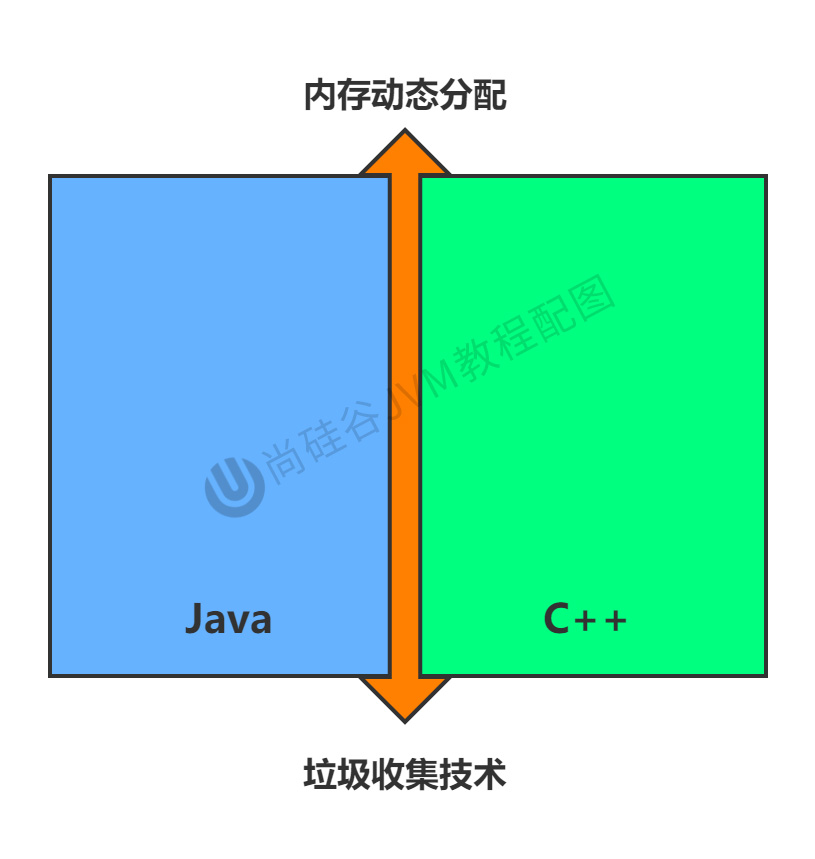
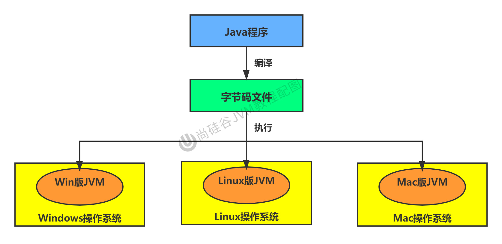
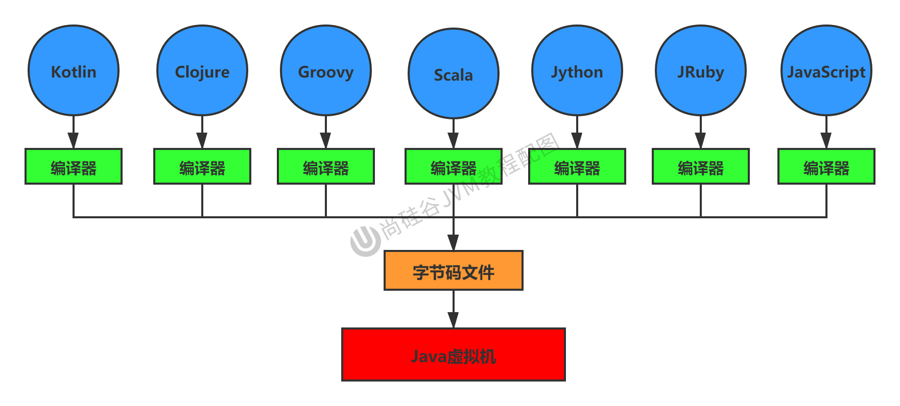
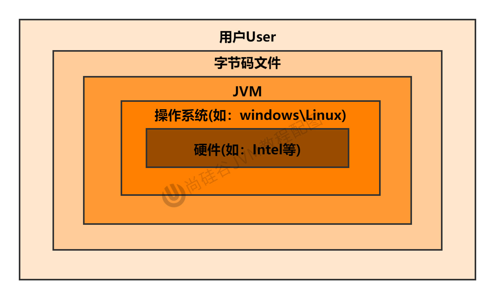
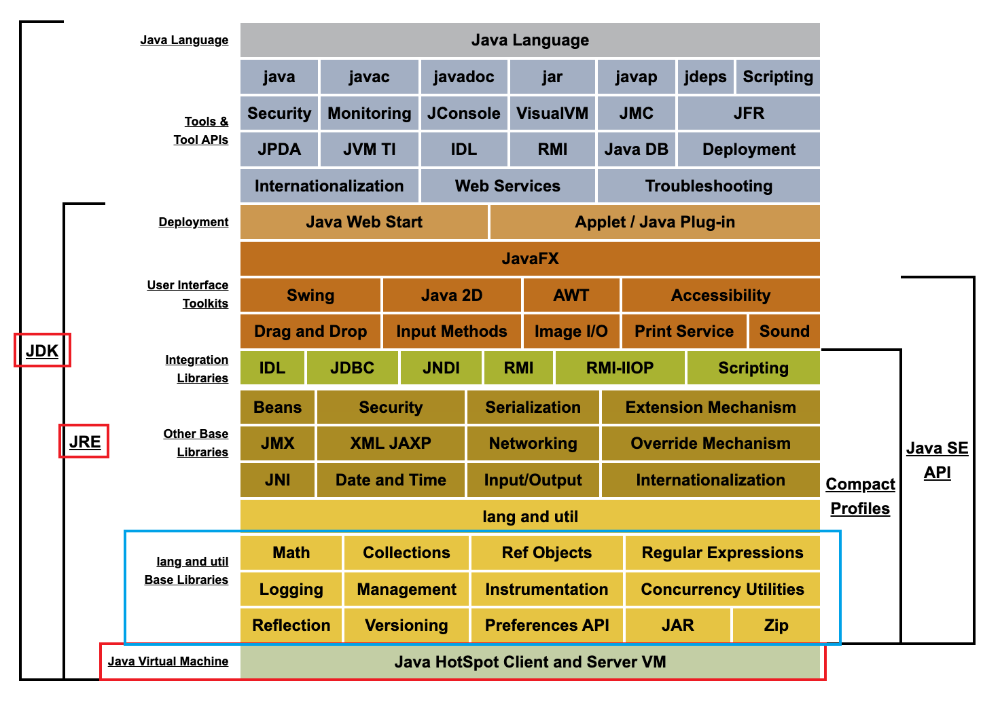

# Chapter01. JVM与Java体系结构

## 1. 前言

大部分Java开发人员，除会在项目中使用到与Java平台相关的各种高精尖技术，对于Java技术的核心Java虚拟机了解甚少。

### 1.1 开发人员如何看待上层框架与底层JVM
* 一些有一定工作经验的开发人员，打心眼儿里觉得SSM、微服务等上层技术才是重点，基础技术并不重要，这其实是一种**本末倒置**的“病态”。
* 如果我们把核心类库的API比做数学公式的话，那么**Java虚拟机**的知识就好比公式的推导过程。

计算机系统体系对我们来说越来越远，在不了解底层实现方式的前提下，通过高级语言很容易编写程序代码。但事实上计算机并不认识高级语言。

在考研时，也只是考基础的**核心知识**，而不会考察高级语言。计算机考研时，除了数学外，最重要的几门课程:
1. 组成原理
2. 操作系统
3. 数据结构与算法
4. 计算机网络

### 1.2 架构师每天都在思考什么？
1. 应该如何让系统更快？
2. 如何避免系统出现问题？

如果在职业道路上感到迷茫，不知道如何精进自己，可以看看招聘网站上对不同职位的要求。比如，知乎上有条帖子：应该如何看招聘信息，直通年薪50万+？
* 参与现有系统的性能优化，重构，保证平台性能和稳定性
* 根据业务场景和需求，决定技术方向，做技术选型
* 能够独立架构和设计海量数据下高并发分布式解决方案，满足功能和非功能需求
* 解决各类潜在系统风险，核心功能的架构与代码编写
* 分析系统瓶颈，解决各种疑难杂症，性能调优等

### 1.3 为什么要学习JVM？
* 面试的需要（BATJ、TMD，PKQ等面试都爱问）
* 中高级程序员必备技能
  * 项目管理、调优的需求
* 追求极客的精神
  * 比如：垃圾回收算法、JIT（及时编译器）、底层原理

### 1.4 Java 🆚 C++

垃圾收集机制为我们打理了很多繁琐的工作，大大提高了开发的效率，但是，垃圾收集也不是万能的，懂得JVM内部的内存结构、工作机制，是设计高扩展性应用和诊断运行时问题的基础，也是Java工程师进阶的必备能力。

C语言需要自己来分配内存和回收内存，Java全部交给JVM进行分配和回收。

## 2. 面向人群及参考书目
* 官方JVM规范: Java8, 11, 17
  * [Java Platform Standard Edition 8 Documentation](https://docs.oracle.com/javase/8/docs/)
  * Java 11
  * Java 17
  * [Java Language and Virtual Machine Specifications(Java语言与虚拟机规范)](https://docs.oracle.com/javase/specs/index.html)

## 3. Java及JVM简介
TIOBE语言热度排行榜

### 3.1 Java生态圈

### 3.2 Java: 跨平台的语言
Java是目前应用最为广泛的软件开发平台之一。随着 Java 以及 Java 社区的不断壮大 Java 也早已不再是简简单单的一门计算机语言了，它更是一个平台、一种文化、一个社区。

作为一个社区，Java 拥有全世界最多的技术拥护者和开源社区支持，有数不清的论坛和资料。从桌面应用软件、嵌入式开发到企业级应用、后台服务器、中间件，都可以看到 Java 的身影。其应用形式之复杂、参与人数之众多也令人咂舌。

* Write once, run anywhere.
* Java程序会转换成字节码文件，转换成的字节码文件通过Java虚拟机运行和处理。

### 3.3 Java虚拟机规范

### 3.4 JVM: 跨平台的语言

* JVM的起始原材料是字节码文件
* 字节码文件可以由不同的语言提供，不同的语言提供各自的编译器，编译生成的字节码遵循JVM的规范，则字节码文件就可以在JVM上运行。

Java虚拟机根本不关心运行在其内部的程序到底是使用何种编程语言编写的，它只关心"字节码"文件。也就是说Java虚拟机拥有语言无关性，并不会单纯地与Java语言"终身绑定"，只要其他编程语言的编译结果满足并包含Java虚拟机的内部指令集、符号表以及其他的辅助信息，它就是一个有效的字节码文件，就能够被虚拟机所识别并装载运行。

### 3.5 字节码
统称JVM字节码

我们平时说的Java字节码，指的是用Java语言编译成的字节码。准确的说任何能在JVM平台上执行的字节码格式都是一样的。所以应该统称为: JVM字节码。

不同的编译器，可以编译出相同的字节码文件，字节码文件也可以在不同的JVM上运行。

### 3.6 多语言混合编程
Java平台上的多语言混合编程正成为主流，通过特定领域的语言去解决特定领域的问题是当前软件开发应对日趋复杂的项目需求的一个方向。

试想一下，在一个项目之中，并行处理用 Clojure 语言编写，展示层使用 JRuby/Rails ，中间层则是 Java ，每个应用层都将使用不同的编程语言来完成，而且，接口对每一层的开发者都是透明的，各种语言之间的交互不存在任何困难，就像使用自己语言的原生 API 一样方便，因为它们最终都运行在一个虚拟机之上。

## 4. Java发展的重大事件
* 1990年，在Sun计算机公司中，由Patrick Naughton、MikeSheridan及James Gosling领导的小组Green Team，开发出的新的程序语言，命名为oak，后期命名为Java
* 1995年，Sun正式发布Java和HotJava产品，Java首次公开亮相。**起始元年**
* 1998，。。。
* 2000年，JDK1.3发布，Java HotSpot Virtual Machine正式发布，称为Java默认的虚拟机。
* 2002年，JDK1.4发布，古老的Classic虚拟机退出历史舞台。
* 2003年年底，Java平台的scala正式发布，同年Groovy也加入了Java阵营。
* 2004年，JDK1.5发布。同时JDK1.5改名为JavaSE5.0。
* 2006年，JDK6发布。同年，Java开源并建立了openJDK。顺理成章，Hotspot虚拟机也成为了openJDK中的默认虚拟机。
* 。。。
* 2011年，JDK7发布。在JDK1.7u4中，正式启用了新的垃圾回收器G1。
* 2017年，JDK9发布。将G1设置为默认Gc，替代CMS
* 
* 2018，JDK11发布，发布革命性的ZGC，调整JDK授权许可
* 2019年，JDK12发布，加入RedHat领导开发的shenandoah GC

在JDK11之前，oracleJDK中还会存在一些openJDK中没有的、闭源的功能。但在JDK11中，我们可以认为openJDK和oracleJDK代码实质上已经完全一致的程度。

## 5. 虚拟机与Java虚拟机
### 5.1 虚拟机
所谓**虚拟机(Virtual Machine)**，就是一台虚拟的计算机。它是一款软件，用来执行一系列虚拟计算机指令。大体上，虚拟机可以分为**系统虚拟机**和**程序虚拟机**。
* 大名鼎鼎的 Visual Box，VMware 就属于**系统虚拟机**，它们完全是对物理计算机的仿真，提供了一个可运行完整操作系统的软件平台。
* **程序虚拟机**的典型代表就是 Java 虚拟机，**它专门为执行单个计算机程序而设计**，在 Java 虚拟机中执行的指令我们称为 Java 字节码指令。

**无论是系统虚拟机还是程序虚拟机，在上面运行的软件都被限制于虚拟机提供的资源中。**

### 5.2 Java虚拟机
Java虚拟机是一台**执行Java字节码**的虚拟计算机，它拥有独立的运行机制，其运行的Java字节码也未必由Java语言编译而成。
* JVM平台的各种语言可以共享Java虚拟机带来的跨平台性、优秀的垃圾回器，以及可靠的即时编译器。
* **Java技术的核心就是Java虚拟机**(JVM，Java Virtual Machine)，因为所有的Java程序都运行在Java虚拟机内部。

**作用:** **Java虚拟机**就是二进制字节码的**运行环境**，负责装载字节码到其内部，解释/编译为对应平台上的机器指令执行。每一条Java指令，Java虚拟机规范中都有详细定义，如怎么取操作数，怎么处理操作数，处理结果放在哪里。

**特点:**
1. 一次编译，到处运行
2. 自动内存管理
3. 自动垃圾回收功能

### 5.3 JVM的位置
JVM是运行在操作系统之上的，它与硬件没有直接的交互

* 最底层的是硬件，比如Intel or AMD的CPU。
* 操作系统，比如Windows/Linux。
* JVM运行在操作系统上，它与最底层的硬件没有直接的交互。

Java的体系结构

## 6. JVM的整体结构
* HotSpot VM是目前市面上高性能JVM的代表作之一。它采用**解释器**与**即时编译器**并存的架构。
* 现如今，Java程序的运行性能已经达到可以与C/C++程序一较高下的地步了。

整体上看，上图分为三层:
1. 加载class files -- 类装载子系统
2. 内存中结构 -- 运行时数据区
   1. 多线程共享
      * Method Area(方法区)
      * heap(堆)
   2. 线程独享
      * Program Counter Register
      * Native Method Stack
      * Java Virtual Machine Stack
3. 解释运行 -- 执行引擎(Execution Engine)
   * 解释器
   * 即时编译器
   * 垃圾回收器

  
## 7. Java代码执行流程

1. Java文件(.java) --(前端编译器)--> 字节码文件
2. 字节码在JVM中运行

## 8. JVM的架构模型
Java编译器输入的指令流基本上是一种**基于栈的指令集架构**，另外一种指令集架构则是基于寄存器的指令集架构。
具体来说：这两种架构之间的区别：
1. 基于栈式架构的特点
   * 设计和实现更简单，适用于资源受限的系统；
   * 避开了寄存器的分配难题：使用零地址指令方式分配。
   * 指令流中的指令大部分是零地址指令，其执行过程依赖于操作栈。指令集更小，编译器容易实现。
   * 不需要硬件支持，可移植性更好，更好实现跨平台
2. 基于寄存器架构的特点
   * 典型的应用是x86的二进制指令集：比如传统的PC以及Android的Davlik虚拟机。
   * 指令集架构则完全依赖硬件，可移植性差
   * 性能优秀和执行更高效
   * 花费更少的指令去完成一项操作。
   * 在大部分情况下，基于寄存器架构的指令集往往都以一地址指令、二地址指令和三地址指令为主，而基于栈式架构的指令集却是以零地址指令为主方水洋

### 8.1 栈
* 跨平台性
* 指令集小
* 指令多
* 执行性能比寄存器差

### 8.2 总结
由于跨平台性的设计，Java的指令都是根据栈来设计的。不同平台CPU架构不同，所以不能设计为基于寄存器的。优点是跨平台，指令集小，编译器容易实现，缺点是性能下降，实现同样的功能需要更多的指令。

时至今日，尽管嵌入式平台已经不是Java程序的主流运行平台了（准确来说应该是HotSpotVM的宿主环境已经不局限于嵌入式平台了），那么为什么不将架构更换为基于寄存器的架构呢？

## 9. JVM的声明周期
启动-->执行-->退出

### 9.1 JVM的启动
Java虚拟机的启动是通过引导类加载器（bootstrap class loader）创建一个初始类（initial class）来完成的，这个类是由虚拟机的具体实现指定的。

### 9.2 JVM的执行
* 一个运行中的Java虚拟机有着一个清晰的任务：执行Java程序。
* 程序开始执行时他才运行，程序结束时他就停止。
* 执行一个所谓的Java程序的时候，真真正正在执行的是一个叫做Java虚拟机的进程。

### 9.3 JVM的退出
有如下的几种情况：
* 程序正常执行结束
* 程序在执行过程中遇到了异常或错误而异常终止
* 由于操作系统用现错误而导致Java虚拟机进程终止
* 某线程调用Runtime类或system类的exit方法，或Runtime类的halt方法，并且Java安全管理器也允许这次exit或halt操作。
* 除此之外，JNI（Java Native Interface）规范描述了用JNI Invocation API来加载或卸载 Java虚拟机时，Java虚拟机的退出情况。

## 10. JVM的发展历程
1. Sun Classic VM
2. Exact VM
3. HotSpot VM
4. JRockit
5. IBM的J9
6. KVM和CDC/CLDC HotSpot
7. Azul VM
8. Liquid VM
9. Apache Marmony
10. Microsoft JVM
11. Taobao JVM
12. Dalvik VM
13. Graal VM

## 总结
具体JVM的内存结构，其实取决于其实现，不同厂商的JVM，或者同一厂商发布的不同版本，都有可能存在一定差异。主要以oracle HotSpot VM为默认虚拟机。

## Reference
* [Java Platform Standard Edition 8 Documentation](https://docs.oracle.com/javase/8/docs/)
* [知乎: 第1章-JVM与Java体系结构](https://zhuanlan.zhihu.com/p/268573466)
* [GitHub: JVM与Java体系结构](https://github.com/wangzy0327/LearningNote/blob/master/JVM/1_%E5%86%85%E5%AD%98%E4%B8%8E%E5%9E%83%E5%9C%BE%E5%9B%9E%E6%94%B6%E7%AF%87/1_JVM%E4%B8%8EJava%E4%BD%93%E7%B3%BB%E7%BB%93%E6%9E%84/README.md)