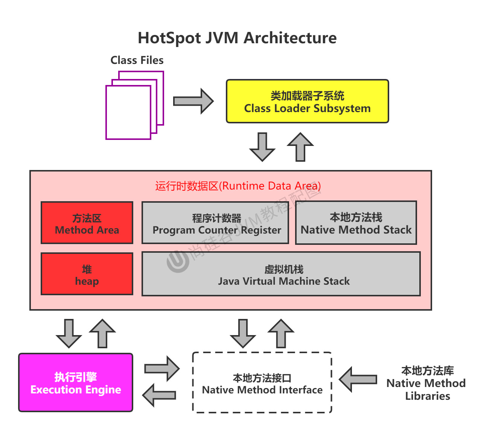
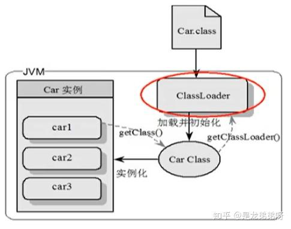

# Chapter02 类加载器与类的加载过程
--子系统(Class Loader Subsystem)--



从JVM架构的简图可以看出JVM主要包含三个部分：
1. 类加载子系统(Class Loader Subsystem)
2. 运行时数据区(Runtime Data Area)
3. 执行引擎 (Execution Engine)

JVM架构详图(中，英)
* 
* 

1. 简图
2. 详细图（中，英）

## 1. 类加载器子系统的加载过程
类加载器子系统分为三个阶段
1. 加载
2. 链接
3. 初始化


* **类加载器子系统**负责从文件系统或者网络中加载class文件，class文件在文件开头右特定的**文件标识(CAFEBABE)**。任何语言都可以考虑使用特定的编译器生成符合Java虚拟机规范的class文件。
* Class loader只负责加载class文件，至于class文件是否可以运行，则右Execution Engine决定。
* 加载的类的信息存放在一块称为**方法区(Method Area)**的内存空间。除了类的信息外，方法区中还会存放**运行时常量池信息**，可能还包括字符串字面量和数字常量(这部分常量信息是class文件中常量池部分的内存映射)。


### 类加载器ClassLoader角色


1. class文件一般存在与本地硬盘上。可以理解为设计师花在纸上的模板，而最终这个模板在执行的时候是要加载到JVM当中，根据这个文件实例化出N个一模一样的实例。
2. class文件被加载到JVM中，被称为DNA元数据模板，放在方法区。
3. 在class文件-->JVM-->最终成为元数据模板，此过程需要一个运输工具(类加载器,Class Loader)，扮演一个快递员的角色。
4. 通过`getClassLoader()`方法可以获取是谁加载的这个类。


## 2. 类的加载过程


例如下面代码的加载流程是什么样的？
```java
public class HelloLoader {
    public static void main(String[] args) {
        System.out.println("我已经被加载啦");
    }
}
```


* 如果class `HelloLoader`没有被加载到JVM中，则需要对`HelloLoader`进行加载，然后才能创建实例。
* 完整的流程包含:
  * 加载(Loading) --> 验证(Verification) --> 准备(Preparation) --> 解析(Resolution) --> 初始化(Initialization)

### 2.1 加载(Loading)
1. 通过一个类的**全限定名**获取定义此类的二进制字节流
2. 将这个字节流所代表的**静态**存储结构转化为**方法区**的运行时数据结构
   * 方法区是一个概念，在具体的JDK版本中有不同的实现。
   * 在JDK7及以前，叫永久代
   * 在JDK8及以后，叫元空间
3. 在内存中生成一个代表这个类的`java.lang.Class`**对象**，作为方法区这个类的各种数据的访问入口。


**补充:** 加载class文件的方式
1. 从本地系统中直接加载
2. 通过网络获取，典型场景: Web Applet
3. 从zip压缩包中读取，称为日后jar、war格式的基础
4. 运行时计算生成，使用对多的是: 动态代理技术
5. 由其他文件生成，典型场景: JSP应用
6. 从专有数据库中提取.class文件，比较少见
7. 从加密文件中获取，典型的防class文件被反编译后的保护措施

### 2.2 链接(Linking)
链接阶段分为三个子阶段
1. 验证(Verify)
   * 目的在于确保class文件中的字节流中包含的字符信息符合当前虚拟机要求，保证被加载类的正确性，不会危害虚拟机自身安全。
   * 主要包括四种验证: 文件格式验证、元数据验证、字节码验证、符号引用验证
   * 比如: class文件以`CAFEBABE`开头
2. 准备(Prepare)
   * 为类变量分配内存并且设置该类变量的默认初始值，即零值
   * 这里不包含用final修饰的static，因为final在编译的时候就会分配了，准备阶段会显式初始化 (`static final`修饰的变量，即为常量)
   * 这里不会为**实例变量**分配初始化，**类变量**会分配在方法区中，而实例变量是会随着对象一起分配到Java堆中。
3. 解析(Resolve)
   * 将常量池内的符号引用转换为直接引用的过程。
   * 事实上，解析操作往往会伴随着JVM在执行完初始化之后再执行。
   * 符号引用就是一组符号来描述所引用的目标。符号引用的字面量形式明确定义在《Java虚拟机规范》的class文件格式中。直接引用就是直接指向目标的指针、相对偏移量或一个间接定位到目标的句柄。
   * 解析动作主要针对类或接口、字段、类方法、接口方法、方法类型等。对应常量池的CONSTANT_Class_inf, CONSTANT_Fieldref_info, CONSTNAT_Methodref_info等。

### 2.3 初始化(Initialization)
* 初始化阶段是执行类构造器方法`<clinit>()`的过程
* 此方法不需要定义，是javac编译器自动收集类中的所有**类变量**的赋值动作和静态方代码块中的语句合并而来。
* 构造器方法中指令按语句在源文件中出现的顺序执行。
* `<clinit>()`不同于类的构造器。(关联: 构造器是虚拟机视角下的`<init>()`)
* 若该类具有父类，JVM会保证子类的`<clinit>()`执行前，父类的`<clinit>()`已经执行完毕。
* 虚拟机必须保证一个类的`<clinit>()`方法在多线程下被同步加锁。
  * `com.atguigu.chapter02.DeadThreadTest`
    * 只会有一个线程初始化`DeadThread`，因为初始化时处于加锁状态


## 3. 类加载器分类
* JVM支持两种类型的类加载器，分别为**引导类加载器(Bootstrap Class Loader)**和**自定义类加载器(User-Defined ClassLoader)**
  * 引导类加载器是由C/C++编写的，无法访问到。
* 从概念上来讲，**自定义类加载器**一般指的是程序中由开发人员自定义的一类类加载器，但是Java虚拟机规范却没有这么定义，而是**将所有派生于抽象类ClassLoader的类加载器都划分为自定义类加载器**。
* 无论类加载器的类型如何划分，在程序中我们最常见的类加载器始终只有三个:
  * Bootstrap Class Loader
  * Extension Class Loader
  * System Class Loader
  * 
* 例子: `com.atguigu.chapter02.classloader.ClassLoaderTest`

### 3.1 启动类加载器(引导类加载, Bootstrap ClassLoader)
就是JVM的一部分，虚拟机自带的加载器。
* 由C/C++语言实现的，嵌套在jvm内部
* 用来加载Java的核心库(`JAVA_HOME/jre/lib/rt.jar`, resources.jar或sun.boot.class.path路径下的内容)，用于提供JVM自身需要的类
* 并不继承`java.lang.ClassLoader`，没有父加载器
* 加载扩展类加载器和应用类加载器(系统类加载器)，并指定为它们的的父加载器
* 出于安全考虑，Bootstrap启动类加载器只加载包名为`java,javax,sun`等开头的类。

### 3.2 扩展类加载器(Extension ClassLoader)
虚拟机自带的加载器
* Java语言编写，由`sum.misc.Launcher$ExtClassLoader`实现
* 派生于`ClassLoader`类
* 父类加载器为启动类加载器
* 从`java.ext.dirs`系统属性所指定的目录中加载类库，或从JDK的安装目录的`jre/lib/ext`子目录(扩展目录)下加载类库。如果用户创建的JAR放在此目录下，也会自动由扩展类加载器加载。

### 3.3 应用程序类加载器(系统类加载器, AppClassLoader)
虚拟机自带的加载器
* Java语言编写，由`sum.misc.Launcher$AppClassLoader`实现
* 派生于`ClassLoader`类
* 父类加载器为扩展类加载器
* 它负责加载环境变量classpath或系统属性java.class.path指定路径下的类库
* 该类即在器是程序中默认的类加载器，一般来说，Java应用的类都是由它来完成加载
* 通过ClassLoader#getSystemClassLoader()方法可以获取到该类加载器

### 3.4 用户自定义类加载器
在Java的日常应用程序开发中，类的加载几乎是由上述三种类加载器相互配合执行的，在必要时，我们还可以自定义类加载器，来定制类的加载方式。

**为什么要自定义类加载器？**
* 隔离加载类
* 修改类加载的方式
* 扩展加载源
* 防止源码泄漏

**用户自定义类加载器实现步骤:**
1. 开发人员可以通过继承抽象类`java.lang.ClassLoader`类的方式，实现自己的类加载器，以满足一些特殊的需求。
2. 在JDK1.2之前，在自定义类加载器时，总会去继承ClassLoader类并重写`loadClass()`方法，从而实现自定义的类加载器，但是在JDK1.2之后，已经不再建议用户去覆盖`loadClass()`方法，而是建议把自定义的类加载逻辑卸载`findClass()`方法中。
3. 在编写自定义类加载器时，如果没有太过于复杂的需求，可以直接继承`URLClassLoader`类，这样就可以避免自己去编写`findClass()`方法及获取字节码流的方式，使自定义类编写更加简洁。
4. Example: `com.atguigu.chapter02.classloader.CustomClassLoader`


## 4. ClassLoader的使用说明
`ClassLoader`是一个抽象类，其后的所有类加载器都继承此类。
* `java.lang.ClassLoader`
*  
* 注: 这些方法都不是抽象方法

**实例:**
* 获取ClassLoader的路径: `com.atguigu.chapter02.classloader.ClassLoaderTest2`
* `sum.misc.Launcher`是一个Java虚拟机的入口应用。

## 5. 双亲委派机制
* Java虚拟机对class文件采用的是**按需加载**的方式，也就是说当需要使用该类时才会将它的class文件加载到内存生成class对象。而且加载某个类的class文件时，Java虚拟机采用的时**双亲委派模式**，即把请求交由父类处理，它是一种任务委派模式。

### 5.1 双亲委派机制原理


* 如果这个父亲加载器收到了类加载的请求，它不会自己加载，而是先把这个请求给自己的父类加载器去执行。
* 如果这个父类加载器还有父类加载器，则会再将请求给自己的父类加载器，依次递归到顶层的启动类加载器。
* 依次进行是否完成委派(加载此类)，若能完成委派则由此类加载器进行加载，若无法完成委派，则将委托给子类加载器进行判断是否能完成委派，依次递归到底层加载器，若期间被加载完成加载阶段，则不会再递归。
    * ⚠️注意: 类只能被一个加载器加载。

### 5.2 双亲委派机制举例2


### 5.2 双亲委派机制优势
1. 避免类的重复加载
2. 保护程序安全，防止核心API被随意篡改
   * 自定义类: java.lang.String，例子: `java.lang.String`(自定义的String类)
   * 自定义类: java.lang.ShkStart

```java
package java.lang;
public class String {
    //
    static{
        System.out.println("我是自定义的String类的静态代码块");
    }
    //错误: 在类 java.lang.String 中找不到 main 方法
    public static void main(String[] args) {
        System.out.println("hello,String");
    }
}

//因为加载的是核心类的String，在String中找不到main方法 
```

### 5.3 沙箱安全机制
自定义String类，但是在加载自定义String类的时候会先使用引导类加载器加载，而引导类加载器在加载的过程中会加载jdk自带的文件(rt.jar包中的java/lang/String.class)，报错信息说没有`main()`方法就是因为加载的`rt.jar`包中的String类。这样可以保证对Java核心源代码的保护，这就是沙箱安全机制。

### 5.4 补充
**在JVM中表示两个class对象是否为同一个类存在两个必要条件:**
1. 类的完整路径名必须一致，包括包名。
2. 加载这个类的ClassLoader(指ClassLoader实例对象)必须相同。

换句话说，在JVM中，即使这两个类对象(class对象)来源是同一个class文件，被同一个虚拟机加载，但只要加载它们的ClassLoader实例对象不同，那么这两个类对象也是不相等的。

**对类加载器的引用:**
* JVM必须要知道一个类型是由启动类加载器加载的还是由用户类加载器加载的。如果一个类型是由用户类加载器加载的，**那么JVM会将这个类加载器的一个引用作为类型信息的一部分保存在方法区中**。当解析一个类型到另一个类型的引用时，JVM需要保证这两个类型的类加载器是相同的。

### 5.5 类的主动使用和被动使用
Java程序对类的使用方式分为: 主动使用和被动使用。
1. 主动使用，又分为七种情况
   1. 创建类的实例
   2. 访问某个类或接口的静态变量，或者对该静态变量赋值
   3. 调用类的静态方法
   4. 反射(比如: `Class.forName("com.atguigu.Test")`)
   5. 初始化一个类的子类
   6. Java虚拟机启动时被标明为启动类的类
   7. JDK7开始提供的动态语言支持: `java.lang.invoke.MethodHandler`实例的解析结果`REF_getStatic, REF_putStatic, REF_invokeStatic`句柄对应类没有初始化，则初始化
2. 除了以上七种，其他使用Java类的方式都被看作是对类的被动使用，都不会导致类的初始化。

## Reference
* 宋红康: JVM从入门到精通
* [是龙弟弟呀: 第2章--类加载子系统](https://zhuanlan.zhihu.com/p/268574484)
* [Java类加载器的底层原理](https://segmentfault.com/a/1190000037678946)
* [双亲委派机制](https://victorfengming.gitee.io/about_jvm/31_%E5%8F%8C%E4%BA%B2%E5%A7%94%E6%B4%BE%E6%9C%BA%E5%88%B6.html)