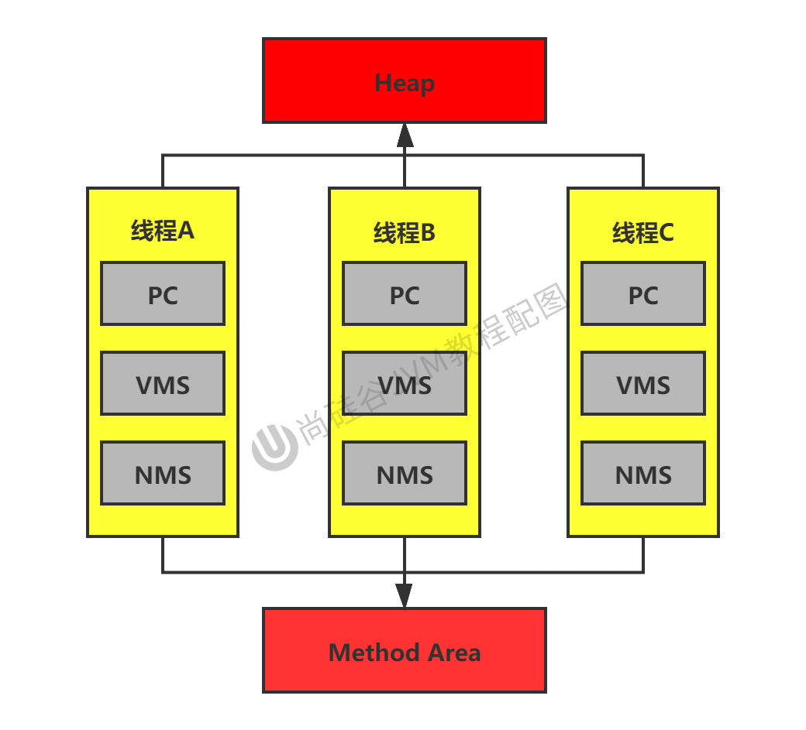
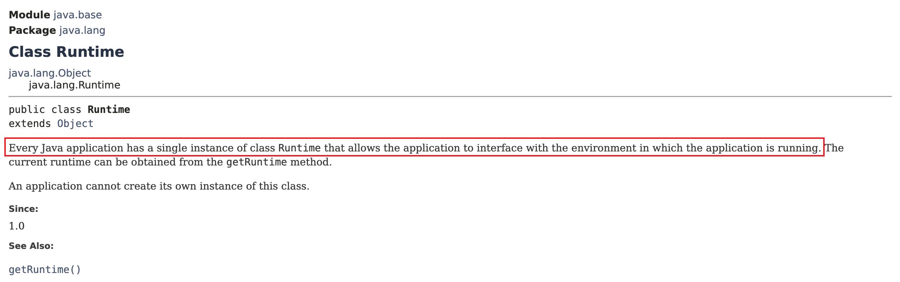
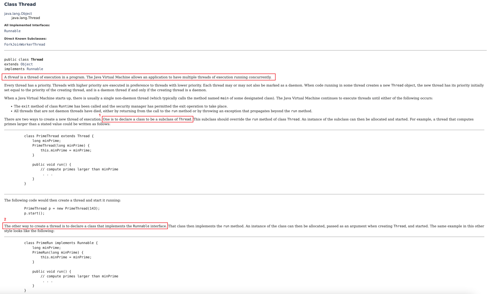

# Chapter03 运行时数据区(Runtime Data Area) & 线程

## 3.1 运行时数据区(Runtime Data Area)
内存是非常重要的系统资源，是硬盘和CPU的中间仓库及桥梁，承载着操作系统和应用程序的实时运行。
JVM内存布局规定了Java在运行过程中内存申请、分配、管理的策略，保证了JVM的高效稳定运行。
**不同JVM对内存的划分方式和管理机制存在着部分差异。**
* 我们通过磁盘或网络IO得到的数据，都需要先加载到**内存中**，然后CPU从内存中读取数据，也就是说内存充当了CPU和硬盘之间的桥梁。

* Method Area 在 JDK8 及以后改称元空间(Metadata space)，使用的是本地内存。

* 类加载子系统(Class Loader Subsystem)负责将class文件加载到内存。
* 左下: 执行引擎
* 右下: 本地方法接口

共享or单独拥有？
* 红色区域为一个**进程**对应一份，也可以理解成一个虚拟机对应一份。
* 灰色区域为一个**线程**对应一份。
  * 一个进程可以包含多个线程。

HotSpot的经典运行时数据区的内存布局(HotSpot JVM)

Java虚拟机定义了若干种程序运行期间会使用到的运行时数据区。其中有一些会伴随着虚拟机启动而创建，随着虚拟机退出而销毁。另一些则是与线程一一对应，这些与线程对应的数据区域会伴随着线程开始和结束而创建和销毁。

灰色的为单独线程私有的，红色的为多个线程共享的。即：
* 每个线程：独立包括程序计数器、栈、本地栈。
  * 永久代和元空间都是方法区的落地实现，理解成方法区就可以
* 线程间共享：堆、**堆外内存**（永久代或元空间、代码缓存）
  * 独立包括程序计数器、栈、本地栈
  * 永久代和元空间可以理解为 Method Area 的落地实现

**关于线程间共享的说明:**

每个 JVM 实例只有一个`Runtime`实例(单例模式)，即为运行时环境，相当于内存结构中间那个框: 运行时环境(Runtime Data Area)。
* 一个JVM实例对应着一个Runtime实例
* [JDK8: java.lang.Runtime](https://docs.oracle.com/javase/8/docs/api/)
* [JDK17: java.lang.Runtime](https://docs.oracle.com/en/java/javase/17/docs/api/java.base/java/lang/Runtime.html)

From JDK8 doc
> Every Java application has a single instance of class Runtime that allows the application to interface with the environment in which the application is running. The current runtime can be obtained from the getRuntime method.
> An application cannot create its own instance of this class.

## 3.2 线程
* 线程是一个程序里的运行单元。JVM允许一个应用有多个线程并行的执行。
* **在Hotspot JVM中，每个线程都与操作系统的本地线程直接映射。**
  * 当一个Java线程准备好执行后，此时一个操作系统的本地线程也同时创建。Java线程执行终止后，本地线程也会回收。
  * 守护线程，用户线程。如果程序中只剩下守护线程，其实 JVM 就可以退出了。
* 操作系统负责所有线程的安排调度到任何一个可用的CPU上。一旦本地线程初始化成功，它就会调用Java线程中的`run()`方法。

* [JDK8: java.lang.Thread](https://docs.oracle.com/javase/8/docs/api/)

### JVM线程系统
如果你使用 jconsole 或者是任何一个调试工具，都能看到在后台有许多线程在运行。这些后台线程不包括调用`public static void main(String[] args)`的main线程以及所有这个main线程自己创建的线程。

这些主要的后台系统线程在Hotspot JVM里主要是以下几个:
* 虚拟机线程: 这种线程的操作是需要JVM达到安全点才会出现。这些操作必须在不同的线程中发生的原因是它们都需要JVM达到安全点，这样堆才不会变化。这种线程的执行类型包括"stop-the-world"的垃圾收集，线程栈收集，线程挂起以及偏向锁撤销。
* 周期任务线程: 这种线程是时间周期事件的体现(比如中断)，它们一般用于周期性操作的调度执行。
* GC线程: 这种线程对在JVM里不同种类的垃圾收集行为提供了支持。
* 编译线程: 这种线程在运行时会将字节码编译成本地代码。
* 信号调度线程: 这种线程接收信号并发送给JVM，在它内部通过调用适当的方法进行处理。

## Reference
* 宋红康
* [3. 运行时数据区及程序计数器](https://www.yuque.com/u21195183/jvm/gia2g0)
* [第3章-运行时数据区概述及线程](https://zhuanlan.zhihu.com/p/268574656)
* [20张图助你了解JVM运行时数据区，你还觉得枯燥吗？](https://cloud.tencent.com/developer/article/1823397)
* [JVM运行时数据区如何划分](https://www.yisuddoscdn.com/zixun/196071.html)