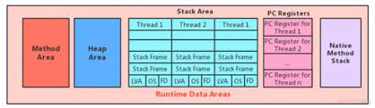
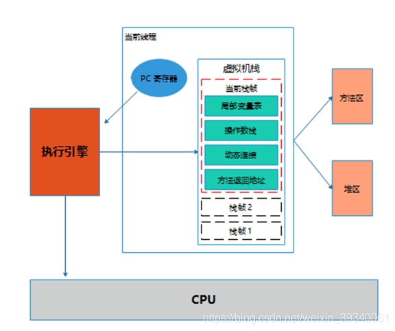
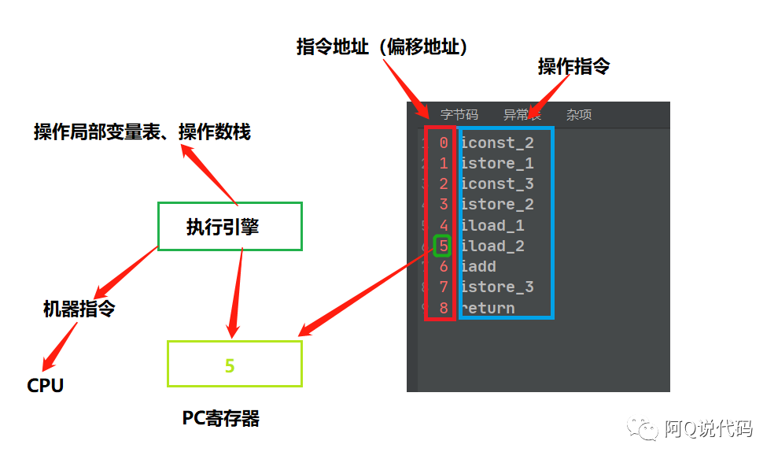

# Chapter04 程序计数器(PC寄存器)

## 1. PC Register介绍


* Stack Area是不考虑垃圾回收的，只有入栈，出栈操作，没有垃圾回收。但是有可能会溢出，即发生OOM
* PC registers也没有垃圾回收，只是不断被替换成下一个地址。不会发生OOM
* Method Area和Heap Area是有垃圾回收。也可能发生溢出，OOM

JVM中的程序计数寄存器(Program Counter Register)中，Register的命名源于CPU的寄存器，寄存器存储指令相关的现场信息。CPU只有把数据装载到寄存器才能够运行。

这里，并非广义上所指的物理寄存器，或许将其翻译为PC寄存器(或指令计数器)会更加贴切，并且也不同意引起一些不必要的误会。**JVM中的PC寄存器是对物理PC寄存器的一种抽象模拟。**

**作用:** PC寄存器用来存储指向下一条指令的地址，也即将要执行的指令代码。由执行引擎读取下一条指令。



**PC Register介绍:**
* 它是一块很小的内存空间，几乎可以忽略不计。也是运行速度最快的存储区域。
* 在JVM规范中，每个线程都由它自己的程序计数器，也是线程私有的，声明周期与线程的声明周期保持一致。
* 任何时间一个线程都只有一个方法在执行，也就是所谓的**当前方法**。程序计数器会存储当前线程正在执行的Java方法的JVM指令地址；或者，如果是在执行native方法，则是为指定值(undefined)。
  * native方法，即C语言写的方法。。。
* 它是程序控制流的指示器，分支、循环、跳转、异常处理、线程恢复等基础功能都需要依赖这个计数器来完成。
* 字节码解释器工作时就是通过改变这个计数器的值来选取下一条需要执行的字节码指令。
* 它是唯一一个在Java虚拟机规范中没有规定任何OutOfMemoryError的区域。


## 2. 举例说明
```shell
➜  atguigu git:(main) javap -verbose PCRegisterTest.class
Classfile /Users/ylqi007/Work/IDEA/JVMTutorial/Chapter04/target/classes/com/atguigu/PCRegisterTest.class
  Last modified Apr 28, 2024; size 507 bytes
  SHA-256 checksum 841a986882305b687dd8a943b9480a3ea26a0d5b188fd5717de064f97cedcf02
  Compiled from "PCRegisterTest.java"
public class com.atguigu.PCRegisterTest
  minor version: 0
  major version: 52
  flags: (0x0021) ACC_PUBLIC, ACC_SUPER
  this_class: #2                          // com/atguigu/PCRegisterTest
  super_class: #3                         // java/lang/Object
  interfaces: 0, fields: 0, methods: 2, attributes: 1
Constant pool:
   #1 = Methodref          #3.#22         // java/lang/Object."<init>":()V
   #2 = Class              #23            // com/atguigu/PCRegisterTest
   #3 = Class              #24            // java/lang/Object
   #4 = Utf8               <init>
   #5 = Utf8               ()V
   #6 = Utf8               Code
   #7 = Utf8               LineNumberTable
   #8 = Utf8               LocalVariableTable
   #9 = Utf8               this
  #10 = Utf8               Lcom/atguigu/PCRegisterTest;
  #11 = Utf8               main
  #12 = Utf8               ([Ljava/lang/String;)V
  #13 = Utf8               args
  #14 = Utf8               [Ljava/lang/String;
  #15 = Utf8               i
  #16 = Utf8               I
  #17 = Utf8               j
  #18 = Utf8               k
  #19 = Utf8               MethodParameters
  #20 = Utf8               SourceFile
  #21 = Utf8               PCRegisterTest.java
  #22 = NameAndType        #4:#5          // "<init>":()V
  #23 = Utf8               com/atguigu/PCRegisterTest
  #24 = Utf8               java/lang/Object
{
  public com.atguigu.PCRegisterTest();
    descriptor: ()V
    flags: (0x0001) ACC_PUBLIC
    Code:
      stack=1, locals=1, args_size=1
         0: aload_0
         1: invokespecial #1                  // Method java/lang/Object."<init>":()V
         4: return
      LineNumberTable:
        line 9: 0
      LocalVariableTable:
        Start  Length  Slot  Name   Signature
            0       5     0  this   Lcom/atguigu/PCRegisterTest;

  public static void main(java.lang.String[]);
    descriptor: ([Ljava/lang/String;)V
    flags: (0x0009) ACC_PUBLIC, ACC_STATIC
    Code:
      stack=2, locals=4, args_size=1
         0: bipush        10
         2: istore_1
         3: bipush        20
         5: istore_2
         6: iload_1
         7: iload_2
         8: iadd
         9: istore_3
        10: return
      LineNumberTable:
        line 11: 0
        line 12: 3
        line 13: 6
        line 14: 10
      LocalVariableTable:
        Start  Length  Slot  Name   Signature
            0      11     0  args   [Ljava/lang/String;
            3       8     1     i   I
            6       5     2     j   I
           10       1     3     k   I
    MethodParameters:
      Name                           Flags
      args
}
SourceFile: "PCRegisterTest.java"
➜  atguigu git:(main)
```



* PC寄存器中保存着指向"操作指令"(i.e. `iload_2`)的"指令地址"(i.e. `5`)。
* 执行引擎会取出对应的操作指令，然后做两件事
  1. 操作局部变量表、操作数栈等完成数据的存、取、加减等操作
  2. 将操作指令翻译成CPU能够识别的机器指令，最后由CPU执行。然后字节码解释器会将PC寄存器的值改为下一条指令的地址，即`6`。


## 3. 两个常见问题
### 3.1 使用PC寄存器存储字节码指令地址有什么用？or 为什么使用PC寄存器记录当前线程的执行地址？

因为CPU需要不停地切换各个线程，切换回来以后，就需要知道接着从哪开始继续执行。
JVM的字节码解释器就需要通过改变PC寄存器的值来明确下一条应该执行什么样的字节码指令。

### 3.2 PC寄存器为什么会被设定为线程私有？
由于JVM的多线程是通过线程轮流切换并分配处理器执行时间的方式来实现的，在任何一个确定的时刻，一个处理器都只会执行一条线程中的指令。因此为了能够准确的记录各个线程正在执行的当前字节码指令地址，最好的办法自然就是为每一个线程都分配一个PC寄存器。这样各条线程之间计数器互不影响，独立存储。

**CPU的时间片:** CPU时间片即CPU分配给各个程序的时间，每个线程被分配一个时间段，称做它的时间片。
* 在宏观上: 我们可以同时打开多个应用程序，每个程序并行不断，同时运行。
* 但微观上: 由于只有一个CPU，一次只能处理程序要求的一部分。如何公平处理？一种方法就是引入时间片，每个程序轮流执行。 


* 并行: vs串行
* 并发: 比如一个CPU处理多个线程，看似并行处理，但实际上是并发，即每个时刻都只处理一个线程。


## Reference
* Java虚拟机规范(The Java® Virtual Machine Specification): https://docs.oracle.com/javase/specs/index.html
* Java8虚拟机规范: https://docs.oracle.com/javase/specs/jvms/se8/html/index.html
* Java11虚拟机规范: https://docs.oracle.com/javase/specs/jvms/se11/html/index.html
* Java17虚拟机规范: https://docs.oracle.com/javase/specs/jvms/se17/html/index.html
* [20张图助你了解JVM运行时数据区，你还觉得枯燥吗？](https://cloud.tencent.com/developer/article/1823397)
* [JVM学习：PC寄存器](https://www.jianshu.com/p/18f2c3463f7f)