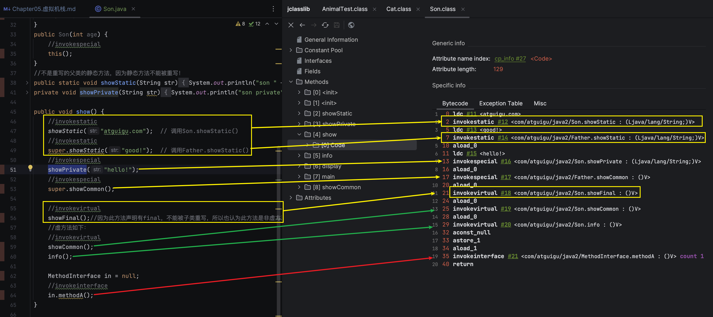

# Chapter05 虚拟机栈

## 1. 虚拟机栈概述
### 1.1 虚拟机栈出现的背景
由于跨平台性的设计，Java的指令都是根据**栈**来设计的。不同平台CPU架构不同，所以不能设计为基于寄存器的。

优点是跨平台，指令集小，编译器容易实现；缺点是性能下降，实现同样的功能需要更多的指令。

### 1.2 初步印象
不少Java开发人员一提到Java内存结构，就会非常粗粒度地将JVM中的内存区域理解为仅有Java堆(heap)和Java栈(stack)？为什么？

### 1.3 内存中的栈和堆
**栈是运行时的单位，而堆是存储的单位。**即
* 栈解决程序的运行问题，即程序如何执行，或者说如何处理数据。
* 堆解决的是数据存储的问题，即数据怎么放，放在哪儿

### 1.4 虚拟机栈基本内容
Java虚拟机栈是什么？
* Java虚拟机栈(Java Virtual Machine Stack)，早期也叫做Java栈，每个线程在创建时都会创建一个虚拟机栈，其内部保存一个个的**栈帧(Stack Frame)**，对应着一次次的Java方法调用。
* 是线程私有的。

**生命周期:** 生命周期和线程一致。

**作用:** 
* 主管Java程序的运行，它保存方法的局部变量(8种基本数据类型，对象的引用地址)、部分结果，并参与方法的调用和返回。
  * 局部变量 vs 成员变量(i.e 属性)
  * 基本数据变量 vs 引用数据变量(类，数组，接口)

**栈的特点(优点):**
* 栈是一种快速有效的分配存储方式，访问速度仅次于程序计数器(PC寄存器)。
* JVM直接对Java栈的操作只有两个:
  1. 每个方法执行，伴随着进栈(入栈、压栈)
  2. 执行结束后的出栈工作
* 对于栈来说，不存在垃圾回收问题。

#### 面试题: 开发中遇到的异常有哪些？
**栈中可能出现的异常:**
* Java虚拟机规范允许Java栈的大小是动态的或者是固定不变的。
  * 如果采用**固定大小**的Java虚拟机栈，那每一个线程的Java虚拟机栈容量可以在线程创建的时候独立选定。如果线程请求分配的栈容量超过Java虚拟机栈允许的最大容量，Java虚拟机将会抛出一个`java.lang.StackOverflowError`异常。
  * 如果Java虚拟机可以**动态扩展**，并且尝试扩展的时候无法申请到足够的内存，或者创建新的线程时没有足够的内存区创建对象的虚拟机栈，那么Java虚拟机会抛出一个`OutOfMemoryError`异常。

**设置栈内存大小:** 我们可以通过使用参数`-Xss`选项来设置线程的最大堆空间，栈的大小直接决定了函数调用的最大可达深度。
> -Xss size
Sets the thread stack size (in bytes). Append the letter k or K to indicate KB, m or M to indicate MB, and g or G to indicate GB. The default value depends on the platform:
> * Linux/x64 (64-bit): 1024 KB
> * macOS (64-bit): 1024 KB
> * Oracle Solaris/x64 (64-bit): 1024 KB
> * Windows: The default value depends on virtual memory
> 
> The following examples set the thread stack size to 1024 KB in different units:
> ```shell
> -Xss1m
> -Xss1024k
> -Xss1048576
> ```
> This option is similar to -XX:ThreadStackSize.


## 2. 栈的存储单位
### 2.1 栈中存储什么？
* 每个线程都有自己的栈，栈中的数据都是以**栈帧(Stack Frame)**的格式存在。
* 在这个线程上正在执行的每个方法都各自对应一个**栈帧(Stack Frame)**
* 栈帧是一个内存区块，是一个数据集，维系着方法执行过程中的各种数据信息。

### 2.2 栈运行原理
* JVM直接对Java栈的操作只有两个，就是对栈帧的压栈和出栈，遵循**"先进后出"**的原则。
* 在一条活动线程中，一个时间点上，只会有一个活动的栈帧。即只有当前正在执行的方法的栈帧(栈顶栈帧)是有效的，这个栈帧被称为当前栈帧(Current Frame)，与当前栈帧相对应的方法就是当前方法(Current Method)，定义这个方法的类就是当前类(Current Class)。
* 执行引擎运行的所有字节码指令只针对当前栈帧进行操作。
* 如果在该方法中调用了其他方法，对应的新的栈帧会被创建出来，放在栈的顶端，称为新的当前栈帧。
* 不同线程中所包含的栈帧是不允许存在相互引用的，即不可能在一个栈帧中引用另一个线程的栈帧。
* 如果当前方法调用了其他方法，方法返回之际，当前栈帧会传回此方法的执行结果给前一个栈帧，接着，虚拟机会丢弃当前栈帧，使得前一个栈帧重新成为当前栈帧。
* Java方法有两种返回函数的方式，一种是正常的函数返回，使用return指令；另外一种是抛出异常。不管使用哪种方式，都会导致栈帧被弹出。


### 2.3 栈帧的内部结构


每个栈帧中存储着:
1. 局部变量表(Local Variables)
2. 操作数栈(Operand Stack) (或表达式栈)
3. 动态链接(Dynamic Linking) (或指向运行时常量池的方法引用)
4. 方法返回地址(Return Address) (或方法正常退出或者异常退出的定义)
5. 一些附加信息

在编译程序代码时，栈帧中需要多大的局部变量表，多深的操作数栈都已经完全确定了，并且写在方法表的Code属性中。


## 3. 局部变量表(Local Variables)
### 3.1 什么是局部变量表
* 局部变量表也被称之为局部变量数组或本地变量表
  * Local Variables: 局部变量表，本地变量表
* 定义为一个数字数组，主要用于存储**方法参数**和定义在方法体内的**局部变量**，这些数据类型包括各类基本数据类型、对象引用(reference)，以及returnAddress类型
* 由于**局部变量表**是建立在线程的栈上，是线程的私有数据，因此不存在数据安全问题
* **局部变量表所需要的容量大小是在编译期间确定下来的**，并保存在方法的Code属性的`maximum local variables`数据项中。在方法运行期间是不会改变局部变量表的大小的。
* 方法嵌套调用的次数由栈的大小决定。一般来说，栈越大，方法嵌套调用次数越多。对一个函数而言，它的参数和局部变量越多，使得局部变量表膨胀，它的栈帧就会占用更过的栈空间，导致其嵌套调用次数就会越少。
* 局部变量表中的变量只在当前方法调用中有效。
  * 在方法执行时，虚拟机通过使用局部变量表完成参数值到参数变量表的传递过程。
  * 当方法调用结束后，随着方法栈的销毁，局部变量表也会随之销毁。

#### 1. 局部变量表结构的认识+内部剖析


### 3.2 变量槽slot的理解与演示
* 参数值的存放总是在局部变量数组的index0开始，到数组长度-1的索引结束。
* 局部变量表，最基本的存储单元是Slot(变量槽)
* 局部变量表中存放编译期可知的各种基本数据类型(8种)，引用类型(reference)，returnAddress类型的变量。
* 在局部变量表里，32位以内的类型只占用一个Slot(包括returnAddress类型)，64位的类型(long和double)占用两个slot。
  * byte、short、char在存储前被转换为int，boolean也被转换为int，0表示false，非0表示true。
  * float也是一个slot
  * long和double则占据两个slot
* JVM会为局部变量表中的每一个slot都分配一个访问索引，通过这个索引即可成功访问到局部变量表中指定的局部变量值。
* 当一个实例方法被调用的时候，它的方法参数和方法体内部定义的局部变量都会按照顺序被赋值到局部变量表中的每一个slot上。
* 如果需要访问局部变量表中的一个64bit的局部变量值时，只需要使用前一个索引即可。(比如，访问long或double类型变量)
* 如果当前帧是由构造方法或者是实例方法创建的，那么该对象引用thi将会存放在index为0的slot为0的slot处，其余的参数按照参数表顺序继续排列。
* 
* 
* 

#### 1. Slot的重复利用
* 栈帧中的局部变量表中的槽位是可以重复用的，如果一个局部变量表过了其作用域，那么在其作用域之后申明的新的局部变量就很有可能会复用过期的局部变量的槽位，从而达到节省资源的目的。
* `com.atguigu.LocalVariablesTest.test4`
* 

#### 2. 举例: 静态变量与局部变量的对比
* 参数表分配完毕后，再根据方法体内定义的变量的顺序和作用域分配。
* 变量表由两次初始化的机会，第一次是在“准备阶段”，执行系统初始化，对类变量设置零值，另一次是在“初始化”阶段，赋予程序员在代码中定义的初始值。
* 和类变量初始化不同的是，局部变量表不存在系统初始化的过程，这意味着一旦定义了局部变量则必须人为的初始化，否则无法使用。
```java
  // java: variable num might not have been initialized
  public void test5Temp(){
      int num;
      // System.out.println(num);//错误信息：变量num未进行初始化
  }
```

### 3.3 补充说明
* 在栈帧中，与性能调优关系最为密切的部分就是局部变量表。在方法执行时，虚拟机使用局部变量表完成方法的传递。
* 局部变量表中的变量也是重要的垃圾回收跟节点，只要被局部变量表中直接或间接引用的对象都不会被回收。


## 4. 操作数栈(Operand Stack)
* Stack: 可以使用数组or链表来实现。
* Operand Stack是用数组实现的。

**操作数栈:**
* 每一个独立的栈帧中除了包含**局部变量表**以外，还包含一个后进先出的**操作数栈**，也可以称之为表达式栈(Expression Stack)
* 操作数栈，在方法执行过程中，根据字节码指令，往栈中写入数据或提取数据，即入栈(push)/出栈(pop)
  * 某些字节码指令将值压入操作数栈，其余的字节码指令将操作数栈取出，使用它们后再把结果压入栈中。
  * 比如：执行复制、交换、求和等操作。
* 操作数栈，主要用于保存计算过程的中间结果，同时作为计算过程中变量临时的存储空间。
* 操作数栈就是JVM执行引擎的一个工作区，当一个方法刚开始执行的时候，一个新的帧栈也会随之被创建出来，这个方法的操作数栈是空的。
* 每个操作数栈都会拥有一个明确的栈深度用于存储数值，其需要的最大深度在编译期就定义好了，保存在方法的Code属性中，为`max_stack`的值。
* 栈中的任何一个元素都是可以任意的Java数据类型
  * 32bit的类型占用一个栈单位深度
  * 64bit的类型占用两个栈单位深度
* 操作数栈并非采用访问索引的方式来进行数据的访问的，而是只能通过标准的入栈(push)和出栈(pop)操作来完成一次数据访问。
* 如果被调用的方法带有返回值的话，其返回值将会被压入当前栈帧的操作数栈中，并更新PC寄存器中下一条需要执行的字节码指令。
* 操作数栈中元素的数据类型必须与字节码指令的序列严格匹配，这由编译器在编译期间进行验证。同时在类加载过程中的类校验阶段的数据流分析阶段要再次验证。
* 另外，Java虚拟机的解释引擎是基于栈的执行引擎，其中的栈指的就是操作数栈。


## 5. 代码追踪
```java
public class OperandStackTest {
    public void testAddOperation() {
        //byte、short、char、boolean：都以int型来保存
        byte i = 15;
        int j = 8;
        int k = i + j;
    }
}
```
* 
* 
* 


### 1. 一个追踪操作数栈的例子
* 

当开始执行一个Java方式时，首先线程会创建该方法的栈帧，栈帧创建**空的操作数栈和局部变量表**，执行过程中，会有各种指令往操作数栈中写入和读取内容，也就是出栈和入栈操作。
1. 执行偏移地址为0的iconst指令(i.e. `iconst_2`)，后面2是跟随的整形常量值2，执行后，2进入操作数栈栈顶。
2. 执行偏移地址为1的istore指令(i.e. `istore_1`)，后面1是局部变量表的索引，取出栈顶元素2放入局部变量表索引为1的位置。
3. 3、4步骤与1、2作用相同。
4. 3、4步骤与1、2作用相同。
5. 执行偏移地址为4的iload指令(i.e. `iload_1`)，后面1是局部变量表的索引，取出变量表索引为1的元素放入栈顶。
6. 执行偏移地址为5的iload指令(i.e. `iload_2`)，后面2是局部变量表的索引，取出变量表索引为2的元素放入栈顶。
7. 执行偏移地址为6的iadd指令(i.e. `iadd`)，取出操作栈栈顶的两个元素，进行相加并将结果放入栈顶。
8. 行偏移地址为7的istore指令(i.e. `istore_3`)，取出栈顶元素放入局部变量表索引为3的位置。
9. 执行偏移地址为8的iload指令(i.e. `iload_3`)，取出局部变量表索引为3的元素放入栈顶。
10. 执行偏移地址为9的ireturn指令，返回栈顶元素给方法调用者。

**总结:**
1. 操作数栈只能通过入栈(push)/出栈(pop)操作，不能通过索引访问。(局部变量表没有此限制)
2. 栈元素类型与局部变量表一致，其中byte，short，char都会转为int类型，32为类型所占的栈容量为1，64bit类型则占用栈容量为2。
3. 操作数栈是方法执行时变量值的临时储存区。


### `i++` vs `++i`的区别
程序员面试中，常见的`i++`和`++i`的区别，放到字节码篇章中再介绍。


## 6. 栈顶缓存技术
基于栈式架构的虚拟机所使用的零地址指令更加紧凑，但完成一项操作的时候需要使用更多的入栈和出栈指令，这同时也就意味着需要将更多的指令分派(instruction dispatch)次数和内存读/写次数。

由于操作数是存储在内存中的，因此频繁地执行内存读/写操作必然会影响执行速度。为了解决这个问题，HotSpot JVM的设计者们提出了栈顶缓存(ToS, Top-of-Stack Caching)技术，将栈顶元素全部缓存在物理CPU的寄存器中，以此降低对内存的读/写次数，提高执行引擎的执行效率。

* 寄存器: 指令更少，执行速度快


## 7. 动态链接(Dynamic Linking)(或指向运行时常量池的方法引用)

注: 有些书上也会将动态链接，方法返回地址，和一些附加信息统称为"帧数据区"。

**动态链接(Dynamic Linking)(或指向运行时常量池的方法引用):**
* 每一个栈帧内部都包含一个指向**运行时常量池**中该栈帧所属方法的引用。包含这个引用的目的就是为了支持当前方法的代码能够实现动态链接(Dynamic Linking)。比如: `invokedynamic`指令。
* 在Java源文件被编译到字节码文件中时，**所有的变量和方法引用**都作为符号引用(Symbolic Reference)保存在class文件的常量池中。比如: 描述一个方法调用了另外的其他方法时，就是通过常量池中指向方法的符号引用来表示的，**那么动态链接的作用就是为了将这些符号引用转换为调用方法的直接引用**。

**动态链接的图示说明:**


* 上图中蓝色栈帧中的橘色部分即为动态链接(i.e.指向运行时常量池中的方法引用)。
* 字节码中的常量池信息(Constant pool)会在加载的时候被加载到方法区，也就是上图中的运行时常量区。
* 一个类的class文件会被加载到Method Area，其中包括类型信息，域信息，方法信息，和运行时常量池等。


描述一个方法调用了另外一个方法时，就是通过常量池中指向方法的符号引用来表示，那么动态链接的作用就是为了将这些**符号引用**转换为调用方法的直接引用。
* 在图1中, `methodB()`调用了`methodA()`。在字节码中，符号链接`#7`就是指向常量池中的方法引用。

class文件中存在一个常量池表(Constant Pool Table)，存了编译后各种字面量的符号引用，其中，方法之间的调用也被表示成符号引用，这种符号引用类加载或者程序执行期间转为直接引用，程序执行期间方法调用从符号引用转为直接引用就是动态链接(Dynamic Linking)。为了支持动态链接实现，每一个栈帧中都有一个执行运行时常量池中该栈帧所属方法的引用。所以想要理解动态链接，就首先要了解虚拟机中是如何进行方法调用的。

为什么需要运行时常量池？
* 字节码文件中需要很多数据的支持，但数据很大，不能直接保存到字节码文件中，所以常量池的作用就是为了提供一些符号和常量，便于指令的识别。


## 8 方法的调用: 解析与分派
### 8.1 静态链接 vs 动态链接
在JVM中，将**符号引用**转换为调用"方法"的**直接引用**与方法的绑定机制相关。

* **静态链接:** 当一个字节码文件被装载进JVM内部时，如果被调用的目标方法在编译期可知，且运行期保持不变时。这种情况下将调用方法的符号引用转换为直接引用的过程称之为静态链接。
* **动态链接:** 如果被调用的方法在编译期无法被确定下来，也就是说，只能够在程序运行期将调用方法的符号引用转换为直接引用，由于这种引用过程具备动态性，因此也被称之为动态链接。

### 8.2 早期绑定 vs 晚期绑定
对应的方法绑定机制为: 早期绑定和晚期绑定。**绑定**是一个字段、方法或者类在符号引用时被替换为直接引用的过程，这仅仅发生一次。
* **早期绑定:** 早期绑定就是指被调用的目标方法如果在编译期可知，且运行期间保持不变时，即可将这个方法与所属类型进行绑定，这样一来，由于明确了被调用的目标方法究竟是哪一个，因此也就可以使用静态链接的方式将符号引用转换为直接引用。
* **晚期绑定:** 如果被调用的方法在编译期间无法被确定下来，只能够在程序运行期间根据时间的类型绑定相关的方法，这种绑定方式也就被称之为晚期绑定。


随着高级语言的横空出世，类似于Java一样的面向与对象的编程语言如今是越来越多，尽管这类编程语言在语法风格上存在一定的差别，但是它们彼此之间始终保持着一个共性，那就是都支持封装、继承和多态等面向对象的特性，既然这一类的编程语言具备多态特性，那么自然也就具备了早期绑定和晚期绑定两种方式。

Java中任何一个普通的方法其实都具备虚函数的特征，它们相当于C++语言中的虚函数(C++中则需要使用关键字`virtual`来显式定义)。如果在Java程序中不希望某个方法拥有虚函数的特征时，则可以使用关键字final来标记这个方法。

### 8.3 方法的调用: 虚方法与非虚方法
**非虚方法:**
* 如果方法在编译期就确定了具体的调用版本，这个版本在运行时是不可变的。这样的方法称为非虚方法。
  * 静态方法、私有方法、final方法、实例构造器、父类方法都是非虚方法。
* 其他方法称为虚方法。

子类对象的多态性的使用前提:
1. 类的继承关系
2. 方法的重写

虚拟机中提供了几条方法调用指令:
* 普通调用指令:
  1. `invokestatic`: 调用静态方法，解析阶段确定唯一方法体。(非虚方法)
  2. `invokespecial`: 调用<init>方法、私有及父类方法，解析阶段确定唯一方法版本。(非虚方法)
  3. `invokevirtual`: 调用所有虚方法。
     * final修饰的方法也是`invokevirtual`调用的，但是这类方法并不是虚方法
  4. `invokeinterface`: 调用接口方法。
* 动态调用指令:
  1. `invokedynamic`: 动态解析出需要调用的方法，然后执行。

前四条指令固化在虚拟机内部，方法的调用执行不可人为干预，而`invokedynamic`指令则支持由用户确定方法版本。其中`invokedynamic`指令和`invokespecial`指令调用的放啊称为非虚方法，其余的(`final`修饰的除外)称为虚方法。

**解析调用:**
* 对于`invokestatic`和`invokespecial`指令调用的方法，在编译期间就可以确定被调用目标方法的版本，并且在运行期间也不会改变，因为静态方法和私有方法，前者跟类型绑定，后者不能被外部访问，它们都不能因为继承或者重写而出现其他方法版本。
* 实例构造方法和父类方法确定之后的版本也不会在运行期间发生改变也不会在运行期间发生改变。
* 另外，还有`final`修饰的方法，因为无法被继承覆盖，所以也会在编译期间确定调用版本，即使它被`invokevirtual`指令调用。(注意: `super.showFinal()`是被`invokespecial`，因为显式加了`super`)
* 所以静态解析的方法有静态方法、私有方法、实例构造方法、父类方法和final修饰的方法五种，这五种方法会在类加载的解析阶段会由符号引用转为该方法的直接引用，上述方法也被称非虚方法，与之对应的是虚方法。

**分配调用:**
* 解析调用是针对编译期间确定调用版本的方法，像实现Java语言多态特性的方法重载和方法重写就会存在多个方法版本，为了筛选目标方法的调用版本，就出现了分派调用方式，分派调用不仅含有静态，也含有动态。



### 8.4 方法调用: 关于`invokedynamic`指令
* JVM字节码指令集一直比较稳定，一直到Java7中才增加了一个`invokedynamic`指令，这是Java为了实现"动态类型语言"支持而做的一种改进。
* 但是在Java7中并没有提供直接生成`invokedynamic`指令的方法，需要借助ASM这种底层字节码工具来产生`invokedynamic`指令。知道Java8的Lambda表达式的出现，`invokedynamic`指令的生成，在Java中才有了直接生成方式。
* Java7中增加了动态语言类型支持的本质是对Java虚拟机规范的修改，而不是对Java语言规则的修改，这一块相对来讲比较复杂，增加了虚拟机中方法调用，最直接的受益者就是运行在Java平台的动态语言的编译器。

**动态类型语言和静态类型语言**
* 动态类型语言和静态类型语言两者的区别就在于对类型的检查是在编译期还是在运行期，满足前者就是静态类型语言，反之是动态类型语言。
* 静态类型语言的判断变量是自身的类型信息；动态类型语言判断变量值的类型信息，**变量**没有类型信息，**变量值**才有类型信息，这是动态语言的一个重要特征。

```
# Java
String info = "atgugu"; // info = atguigu, 报错

# JS
var name = "atguigu"; 
var name = 10;

# Python
info = 130.5;
```
* Java是静态类型语言；JavaScript/Python是动态类型语言。

### 8.5 方法的调用: 方法重写本质
Java语言中方法重写(`@Override`)的本质:
1. 找到操作数栈顶的第一个元素所执行的对象的实际类型，记作C。
2. 如果在过程结束: 如果不通过类型C中找到与常量中的描述符合简单名称都相符的方法。。。IllegalAccessError
3. 否则，按照继承关系从下往上依次对C的各个父类进行第2步的搜索和验证过程。
4. 如果始终没有找到合适的方法，则抛出`java.lang.AbstractMethodError`异常。

**IllegalAccessError介绍:** 程序试图访问或修改一个属性或调用一个方法，这个属性或方法，你没有权限访问。一般的，这个会引起编译器异常。这个报错如果发生在运行时，就说明一个类发生了不兼容的改变。

**虚方法表:** 
* 在面向对象的编程中，会很频繁的使用到动态分派。如果在每次动态分派的过程中都要重新在类的方法元数据中搜索合适的目标的话，就可能影响到执行效率。因此，为了提高新能，JVM采用在类的方法区建立一个虚方法表(Virtual method table)(非虚方法不会出现在表中)来实现。使用索引表来代替查找。
* 每个类中都有一个虚方法表，表中存放着各个方法的实际入口。
* 虚方法表中存放着各个方法的实际入口地址，如果某个方法在子类没有被重写，那么该方法在子类和父类的虚方法表中的实际入口地址是一样的，都指向父类的入口，如果重写了，子类虚方法表的地址就会被替换为重写的方法入口地址。
* 那么虚方法表什么时候被创建？虚方法表会在类加载的链接阶段被创建并开始初始化，类的变量初始值准备完成之后，JVM会把该类的方法表也初始化完毕。


* `Son`类重写了`Father`的全部方法，所以`Son`类的方法没有指向`Father`的类型数据(方法的直接引用存于方法区类型数据中)
* `Son`和`Father`都没有重写`Object`的方法，所以虚方法表中没有个重写的方法都指向了`Object`的类型数据。


## 9 方法返回地址(Return Address)
* 存放调用该方法的pc寄存器的值。
* 一个方法的结束，有两种方式:
  * 正常执行完成
  * 出现未处理的异常，非正常退出
* 无论通过哪种方式退出，在方法退出后都返回到该方法被调用的位置。方法正常退出时，调用者的pc寄存器的值作为返回地址，即调用该方法的指令的下一条指令的地址。而通过异常退出的，返回地址是要通过异常表来确定，栈帧中一般不会保存这部分信息。

正常完成出口和异常完成出口的区别在于: 通过异常完成出口退出的不会给它的上层调用者产生任何返回值。

当一个方法开始执行后，只有两种方式可以退出这个方法:
1. **正常结束:** 执行引擎遇到任意一个方法返回的字节码指令(return), 会有返回值传递给上层的方法调用者，简称正常完成出口。
   * 一个方法在正常调用完成之后究竟需要使用哪一个返回指令，还需要根据方法返回值的实际类型而定。
   * 在字节码指令中，返回指令包含`ireturn`(当返回值是boolean, byte, char, short和int类型时使用), `lreturn,freturn,dreturn,areturn`，另外还有一个`return`指令供声明为void的方法、实例初始化方法、类和接口的初始化方法使用。
2. **异常结束:** 在方法执行的过程中遇到了异常(Exception)，并且这个异常没有在方法内进行处理，也就是只要在本方法的异常表中没有搜索到匹配的异常处理器，就会导致方法退出，简称异常完成出口。
   * 方法执行过程中抛出异常时的异常处理，存储一个异常处理表，方便在发生异常的时候找到处理异常的代码。

无论以哪种方式结束，都要返回到调用该方法的上层方法的位置，方法正常退出时，会将上层方法调用该方法时程序计数器的值作为返回。异常退出时，返回地址需要通过异常表来确定，栈帧通常不会保存这部分信息。本质上，方法的退出就是当前栈帧出栈的过程。此时，需要恢复上层方法的局部变量表、操作数栈、将返回值压入调用者栈帧的操作数栈、设置pc寄存器值等，让调用者方法继续执行下去，也就是让线程在方法调用处继续执行下去。


## 10 一些附加信息
栈帧中还运行携带与Java虚拟机实现相关的一些附加信息。例如，对程序调试提供支持的信息。其他四个是必须的，这个是可选的。


## 11 栈的相关面试题
### 1. 举例栈溢出的情况？
* StackOverflowError
* 通过`-Xss`设置栈的大小
* 栈空间可以是固定的，也可以是动态变化的
  * 如果是固定的，则可能会出现`StackOverflowError`
  * 如果是变化的，当内存空间不足时，无法扩容时，会出现OOM

### 2. 调整栈大小，就能保证不出现溢出吗？
不能保证
* 可能可以延迟StackOverflowError的出现，

### 3. 分配的栈内存越大越好吗？
不是。整个内存空间是有限的，会挤占其他线程空间，从而限制线程数。

### 4. 垃圾回收是否涉及到虚拟机栈？
不会。 

* 程序计数器不会出现Error，也没有GC
* 虚拟机栈会出现Error，但是没有GC，因为只有入栈/出栈
* 本地方法栈，调用C，也是栈，存在Error，不存在GC
* 堆：Error，GC
* 方法区：Error，GC

### 5. 方法中定义的局部变量是否线程安全？
具体问题具体分析
* Example: `com.atguigu.java3.StringBuilderTest`


## Reference
* 宋红康
* [JDK 11 Documentation](https://docs.oracle.com/en/java/javase/11/)
* [Tools Reference](https://docs.oracle.com/en/java/javase/11/tools/tools-and-command-reference.html#JSWOR-GUID-55DE52DF-5774-4AAB-B334-E026FBAE6F34)
* [JVM栈帧的内部结构](https://blog.csdn.net/u011069294/article/details/107066447)
* [20张图助你了解JVM运行时数据区，你还觉得枯燥吗？](https://cloud.tencent.com/developer/article/1823397)
* [【面试题精讲】JVM-运行时数据区-局部变量表](https://developer.aliyun.com/article/1363776#:~:text=%E5%B1%80%E9%83%A8%E5%8F%98%E9%87%8F%E8%A1%A8%E6%98%AFJava,%E5%87%BA%E6%9B%B4%E9%AB%98%E6%95%88%E7%9A%84%E7%A8%8B%E5%BA%8F%E3%80%82)
* [JVM栈帧：局部变量表、操作数栈](https://juejin.cn/post/7035960136233402382)
* [第五篇 JVM之运行时数据区<1>: 程序计数器](https://www.cnblogs.com/zhexuejun/p/15472779.html)
* [第六篇 JVM之运行时数据区<2>: 虚拟机栈](https://www.cnblogs.com/zhexuejun/p/15480505.html)
* [第七篇 JVM之运行时数据区<3>: 局部变量表](https://www.cnblogs.com/zhexuejun/p/15498915.html)
* [第八篇 JVM之运行时数据区<4>: 操作数栈](https://www.cnblogs.com/zhexuejun/p/15509161.html)
* [第九篇 JVM之运行时数据区<5>: 动态链接](https://www.cnblogs.com/zhexuejun/p/15586428.html)
* [第十篇 JVM之运行时数据区<6>: 方法返回](https://www.cnblogs.com/zhexuejun/p/15631059.html)
* [3.动态链接（Dynamic Linking【指向运行时常量池的方法引用】）](https://www.cnblogs.com/Timeouting-Study/p/12511969.html)
* [沉默王二: 深入理解 JVM 的栈帧结构](https://javabetter.cn/jvm/stack-frame.html)
* :white_check_mark: [Java虚拟机—栈帧、操作数栈和局部变量表](https://zhuanlan.zhihu.com/p/45354152)
* [JVM-栈帧之局部变量表](https://www.cnblogs.com/niulongwei/p/14864516.html)
* [JVM（三）虚拟机栈 多合一总述](https://www.cnblogs.com/Timeouting-Study/p/12493906.html)