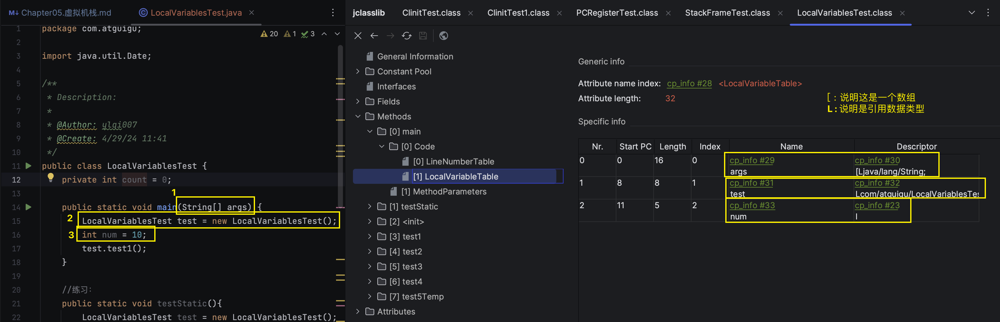

# Chapter05 虚拟机栈

## 1. 虚拟机栈概述
### 1.1 虚拟机栈出现的背景
由于跨平台性的设计，Java的指令都是根据**栈**来设计的。不同平台CPU架构不同，所以不能设计为基于寄存器的。

优点是跨平台，指令集小，编译器容易实现；缺点是性能下降，实现同样的功能需要更多的指令。

### 1.2 初步印象
不少Java开发人员一提到Java内存结构，就会非常粗粒度地将JVM中的内存区域理解为仅有Java堆(heap)和Java栈(stack)？为什么？

### 1.3 内存中的栈和堆
**栈是运行时的单位，而堆是存储的单位。**即
* 栈解决程序的运行问题，即程序如何执行，或者说如何处理数据。
* 堆解决的是数据存储的问题，即数据怎么放，放在哪儿

### 1.4 虚拟机栈基本内容
Java虚拟机栈是什么？
* Java虚拟机栈(Java Virtual Machine Stack)，早期也叫做Java栈，每个线程在创建时都会创建一个虚拟机栈，其内部保存一个个的**栈帧(Stack Frame)**，对应着一次次的Java方法调用。
* 是线程私有的。

**生命周期:** 生命周期和线程一致。

**作用:** 
* 主管Java程序的运行，它保存方法的局部变量(8种基本数据类型，对象的引用地址)、部分结果，并参与方法的调用和返回。
  * 局部变量 vs 成员变量(i.e 属性)
  * 基本数据变量 vs 引用数据变量(类，数组，接口)

**栈的特点(优点):**
* 栈是一种快速有效的分配存储方式，访问速度仅次于程序计数器(PC寄存器)。
* JVM直接对Java栈的操作只有两个:
  1. 每个方法执行，伴随着进栈(入栈、压栈)
  2. 执行结束后的出栈工作
* 对于栈来说，不存在垃圾回收问题。

#### 面试题: 开发中遇到的异常有哪些？
**栈中可能出现的异常:**
* Java虚拟机规范允许Java栈的大小是动态的或者是固定不变的。
  * 如果采用**固定大小**的Java虚拟机栈，那每一个线程的Java虚拟机栈容量可以在线程创建的时候独立选定。如果线程请求分配的栈容量超过Java虚拟机栈允许的最大容量，Java虚拟机将会抛出一个`java.lang.StackOverflowError`异常。
  * 如果Java虚拟机可以**动态扩展**，并且尝试扩展的时候无法申请到足够的内存，或者创建新的线程时没有足够的内存区创建对象的虚拟机栈，那么Java虚拟机会抛出一个`OutOfMemoryError`异常。

**设置栈内存大小:** 我们可以通过使用参数`-Xss`选项来设置线程的最大堆空间，栈的大小直接决定了函数调用的最大可达深度。
> -Xss size
Sets the thread stack size (in bytes). Append the letter k or K to indicate KB, m or M to indicate MB, and g or G to indicate GB. The default value depends on the platform:
> * Linux/x64 (64-bit): 1024 KB
> * macOS (64-bit): 1024 KB
> * Oracle Solaris/x64 (64-bit): 1024 KB
> * Windows: The default value depends on virtual memory
> 
> The following examples set the thread stack size to 1024 KB in different units:
> ```shell
> -Xss1m
> -Xss1024k
> -Xss1048576
> ```
> This option is similar to -XX:ThreadStackSize.


## 2. 栈的存储单位
### 2.1 栈中存储什么？
* 每个线程都有自己的栈，栈中的数据都是以**栈帧(Stack Frame)**的格式存在。
* 在这个线程上正在执行的每个方法都各自对应一个**栈帧(Stack Frame)**
* 栈帧是一个内存区块，是一个数据集，维系着方法执行过程中的各种数据信息。

### 2.2 栈运行原理
* JVM直接对Java栈的操作只有两个，就是对栈帧的压栈和出栈，遵循**"先进后出"**的原则。
* 在一条活动线程中，一个时间点上，只会有一个活动的栈帧。即只有当前正在执行的方法的栈帧(栈顶栈帧)是有效的，这个栈帧被称为当前栈帧(Current Frame)，与当前栈帧相对应的方法就是当前方法(Current Method)，定义这个方法的类就是当前类(Current Class)。
* 执行引擎运行的所有字节码指令只针对当前栈帧进行操作。
* 如果在该方法中调用了其他方法，对应的新的栈帧会被创建出来，放在栈的顶端，称为新的当前栈帧。
* 不同线程中所包含的栈帧是不允许存在相互引用的，即不可能在一个栈帧中引用另一个线程的栈帧。
* 如果当前方法调用了其他方法，方法返回之际，当前栈帧会传回此方法的执行结果给前一个栈帧，接着，虚拟机会丢弃当前栈帧，使得前一个栈帧重新成为当前栈帧。
* Java方法有两种返回函数的方式，一种是正常的函数返回，使用return指令；另外一种是抛出异常。不管使用哪种方式，都会导致栈帧被弹出。


### 2.3 栈帧的内部结构


每个栈帧中存储着:
1. 局部变量表(Local Variables)
2. 操作数栈(Operand Stack) (或表达式栈)
3. 动态链接(Dynamic Linking) (或指向运行时常量池的方法引用)
4. 方法返回地址(Return Address) (或方法正常退出或者异常退出的定义)
5. 一些附加信息


## 3. 局部变量表
### 3.1 什么是局部变量表
* 局部变量表也被称之为局部变量数组或本地变量表
  * Local Variables: 局部变量表，本地变量表
* 定义为一个数字数组，主要用于存储**方法参数**和定义在方法体内的**局部变量**，这些数据类型包括各类基本数据类型、对象引用(reference)，以及returnAddress类型
* 由于**局部变量表**是建立在线程的栈上，是线程的私有数据，因此不存在数据安全问题
* **局部变量表所需要的容量大小是在编译期间确定下来的**，并保存在方法的Code属性的`maximum local variables`数据项中。在方法运行期间是不会改变局部变量表的大小的。
* 方法嵌套调用的次数由栈的大小决定。一般来说，栈越大，方法嵌套调用次数越多。对一个函数而言，它的参数和局部变量越多，使得局部变量表膨胀，它的栈帧就会占用更过的栈空间，导致其嵌套调用次数就会越少。
* 局部变量表中的变量只在当前方法调用中有效。
  * 在方法执行时，虚拟机通过使用局部变量表完成参数值到参数变量表的传递过程。
  * 当方法调用结束后，随着方法栈的销毁，局部变量表也会随之销毁。

#### 1. 局部变量表结构的认识+内部剖析



### 3.2 变量槽slot的理解与演示
* 参数值的存放总是在局部变量数组的index0开始，到数组长度-1的索引结束。
* 局部变量表，最基本的存储单元是Slot(变量槽)
* 局部变量表中存放编译期可知的各种基本数据类型(8种)，引用类型(reference)，returnAddress类型的变量。
* 在局部变量表里，32位以内的类型只占用一个Slot(包括returnAddress类型)，64位的类型(long和double)占用两个slot。
  * byte、short、char在存储前被转换为int，boolean也被转换为int，0表示false，非0表示true。
  * float也是一个slot
  * long和double则占据两个slot
* JVM会为局部变量表中的每一个slot都分配一个访问索引，通过这个索引即可成功访问到局部变量表中指定的局部变量值。
* 当一个实例方法被调用的时候，它的方法参数和方法体内部定义的局部变量都会按照顺序被赋值到局部变量表中的每一个slot上。
* 如果需要访问局部变量表中的一个64bit的局部变量值时，只需要使用前一个索引即可。(比如，访问long或double类型变量)
* 如果当前帧是由构造方法或者是实例方法创建的，那么该对象引用thi将会存放在index为0的slot为0的slot处，其余的参数按照参数表顺序继续排列。
* 
* 
* 

#### 1. Slot的重复利用
* 栈帧中的局部变量表中的槽位是可以重复用的，如果一个局部变量表过了其作用域，那么在其作用域之后申明的新的局部变量就很有可能会复用过期的局部变量的槽位，从而达到节省资源的目的。
* `com.atguigu.LocalVariablesTest.test4`
* 

#### 2. 举例: 静态变量与局部变量的对比
* 参数表分配完毕后，再根据方法体内定义的变量的顺序和作用域分配。
* 变量表由两次初始化的机会，第一次是在“准备阶段”，执行系统初始化，对类变量设置零值，另一次是在“初始化”阶段，赋予程序员在代码中定义的初始值。
* 和类变量初始化不同的是，局部变量表不存在系统初始化的过程，这意味着一旦定义了局部变量则必须人为的初始化，否则无法使用。
```java
  // java: variable num might not have been initialized
  public void test5Temp(){
      int num;
      // System.out.println(num);//错误信息：变量num未进行初始化
  }
```

### 3.3 补充说明
* 在栈帧中，与性能调优关系最为密切的部分就是局部变量表。在方法执行时，虚拟机使用局部变量表完成方法的传递。
* 局部变量表中的变量也是重要的垃圾回收跟节点，只要被局部变量表中直接或间接引用的对象都不会被回收。


## 5.4 操作数栈
## 5.5 代码追踪
## 5.6 栈顶缓存技术
## 5.7 动态链接
## 5.8 方法的调用: 解析与分派
## 5.9 方法返回地址
## 5.10 一些附加信息
## 5.11 栈的相关面试题

## Reference
* 宋红康
* [JDK 11 Documentation](https://docs.oracle.com/en/java/javase/11/)
* [Tools Reference](https://docs.oracle.com/en/java/javase/11/tools/tools-and-command-reference.html#JSWOR-GUID-55DE52DF-5774-4AAB-B334-E026FBAE6F34)
* [JVM栈帧的内部结构](https://blog.csdn.net/u011069294/article/details/107066447)
* [20张图助你了解JVM运行时数据区，你还觉得枯燥吗？](https://cloud.tencent.com/developer/article/1823397)
* [【面试题精讲】JVM-运行时数据区-局部变量表](https://developer.aliyun.com/article/1363776#:~:text=%E5%B1%80%E9%83%A8%E5%8F%98%E9%87%8F%E8%A1%A8%E6%98%AFJava,%E5%87%BA%E6%9B%B4%E9%AB%98%E6%95%88%E7%9A%84%E7%A8%8B%E5%BA%8F%E3%80%82)
* [JVM栈帧：局部变量表、操作数栈](https://juejin.cn/post/7035960136233402382)
* [第七篇 JVM之运行时数据区<3>: 局部变量表](https://blog.51cto.com/u_15127583/4530206)
* :white_check_mark: [Java虚拟机—栈帧、操作数栈和局部变量表](https://zhuanlan.zhihu.com/p/45354152)
* [JVM-栈帧之局部变量表](https://www.cnblogs.com/niulongwei/p/14864516.html)