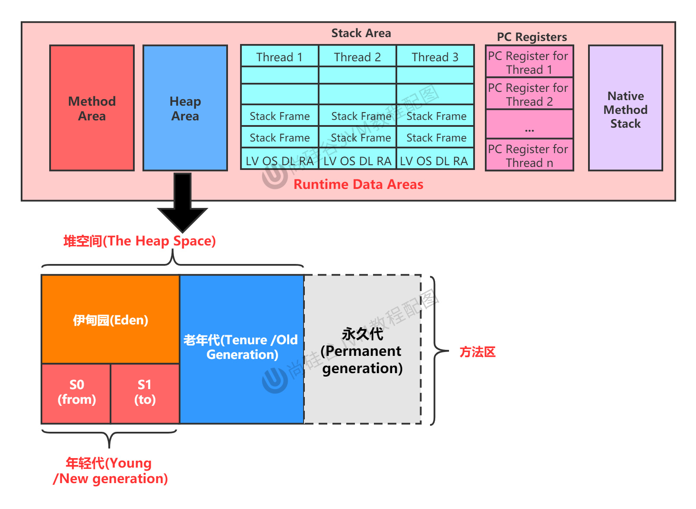

# Chapter08 堆(Heap)

## 8.1 堆的核心概述


* 红色的方法区和堆对于一个进程而言，都是唯一的。

堆(Heap)是JVM运行时数据区(Runtime Data Area)占用内存最大的一块区域。每一个运行的Java程序对应一个JVM进程，每一个JVM进程只存在一个堆区，它在JVM启动时被创建。JVM规范中规定堆区可以是物理上不连续的内存，但必须是逻辑上连续的内存。
* 一个JVM实例只存在一个堆内存，堆也是Java内存管理的核心区域。
* Java堆区在JVM启动的时候即被创建，其空间大小也就确定了，是JVM管理的最大一块内存空间。
  * 堆内存的大小是可以调节的。
* 《Java虚拟机规范》规定，堆可以处于物理上不连续的内存空间中，但在逻辑上，它应该被视为连续的。
* 所有的线程共享Java堆，在这里还可以划分线程私有的缓冲区(Thread Local Allocation Buffer, TLAB)
* 《Java虚拟机规范》中对Java堆的描述是: 所有的对象实例以及数组都应当在运行时分配堆上。(The heap is the runtime data area from which memory for all class instances and arrays is allocated)。
  * 我(shk)要说的是:"几乎"所有的对象实例都在这里分配内存。--从实际使用角度看。
* 数组和对象可能永远不会存储在栈上，因为栈帧中保存引用，这个引用指向对象或者数组在堆中的位置。
* 在方法结束后，堆中的对象不会马上被移除，仅仅在垃圾收集的时候才会被移除。
* 堆，是GC(Garbage Collection, 垃圾收集器)执行垃圾回收的重点区域。


* 栈负责运行
* 堆负责存储
* 方法区

### 8.1.1 堆的核心概述: 内存细分
现代垃圾回收器大部分都基于分代收集理论设计，堆空间细分为:
* Java7及以前的堆内存逻辑上分为三部分: 新生区 + 养老区 + **永久区**
  * Young Generation Space
    * 又被划分为Eden区和Survivor区
  * Tenure Generation Space
  * **Permanent Space**
* Java8及以后内存逻辑上分为三部分: 新生区 + 养老区 + **元空间**
  * Young Generation Space
    * 又被划分为Eden区和Survivor区
  * Tenure Generation Space
  * **Meta Space**
* 约定: 新生去 <==> 新生代 <==> 年轻代； 养老区 <==> 老年区 <==> 老年代；永久区 <==> 永久代

**堆内存细节，自JDK8开始有区别:**




Example: `com.atguigu.java.HeapDemo`


## 8.2 设置堆内存大小与OOM
* Java堆区用于存储Java对象实例，那么堆的大小在JVM启动时就已经设定好了，大家可以通过选项`-Xmx`和`-Xms`来进行设置。
  * `-Xms`用于表示堆区的起始内存，等价于`-XX:InitialHeapSize`
  * `-Xmx`用于表示堆区的最大内存，等价于`-XX:MaxHeapSize`
  * `-Xmn`用于设置年轻代内存，一般不用，而是用`-XX:NewRatio`
* 一旦堆区中的内存大小超过`-Xmx`所指定的最大内存时，将会抛出`OutOfMemoryError`异常。
* 通常会将`-Xms`和`-Xmx`两个参数配置相同的值，其目的是为了能够在Java垃圾回收机制清理完堆区后，不需要再重新分隔计算堆区的大小，从而提高性能。
* 默认情况下: 
  * 初始内存大小: 物理内存大小/64
  * 最大内存大小: 物理内存大小/4


## 8.3 年轻代与老年代
* 存储在JVM中的Java对象可以划分为两类：
  * 一类是生命周期比较短的瞬时对象，这类对象的创建和消亡都非常迅速。
  * 另一类对象的生命周期却非常长，在某些极端的情况下还能够与JVM的生命周期保持一致。
* Java堆区进一步细分的话，可以划分为年轻代(YoungGen)和老年代(OldGen)。
* 其中年轻代又可以划分为Eden空间、Survivor0空间和Survivor1空间(有时也叫做from区和to区)
* 
* 1. 伊甸区(Eden): 存放大部分新创建对象。
  2. 幸存区(Survivor): 存放Minor GC之后，Eden区和幸存区(Survivor)本身没有被回收的对象。
  3. 老年区: 存放Minor GC之后且年龄计算器达到15依然存活的对象、Major GC和Full GC之后仍然存活的对象。
* 在HotSpot中，Eden空间和另外两个Survivor空间缺省所占比例是8:1:1
* 当然，开发人员可以通过选项`-XX:SurvivorRatio`调整这个比例。比如`-XX:SurvivorRatio=8`
* **几乎**所有的Java对象都是在Eden区中被new出来的。
* 绝大部分的Java对象的销毁都在新生代进行了。
  * IBM公司的专门研究表明，新生代中80%的对象都是"朝生夕死"的。
* 可以使用选项`-Xmn`设置新生代最大内存大小
  * 这个参数一般使用默认值就可以了

**下面这些参数开发中一般不会调:**
1. 配置新生代与老年代在堆结构中的占比:
   * 默认`-XX:NewRatio=2`，表示新生代占1，老年代占2，新生代占整个堆的1/3
   * 可以修改`-XX:NewRatio=4`，表示新生代占1，老年代占4，新生代占整个堆的1/5
   * 
2. 配置Eden空间和另外两个Survivor空间所占比例
   * 默认是`-XX:SurvivorRatio=8`
   * 
   * 

可以通过CLI查看`NewRatio`
```shell
➜  JVMTutorial git:(main) ✗ jps
92657 Jps
22930 Main
1332 
23481 
92303 EdenSurvivorTest
92302 Launcher
➜  JVMTutorial git:(main) ✗ jinfo -flag NewRatio 92303
-XX:NewRatio=2
➜  JVMTutorial git:(main) ✗ jinfo -flag SurvivorRatio 92303 
-XX:SurvivorRatio=8
➜  JVMTutorial git:(main) ✗ jstat -gc 92303
    S0C         S1C         S0U         S1U          EC           EU           OC           OU          MC         MU       CCSC      CCSU     YGC     YGCT     FGC    FGCT     CGC    CGCT       GCT   
    25600.0     25600.0         0.0         0.0     153600.0     110603.7     409600.0          0.0     4480.0      779.6     384.0      76.0      0     0.000     0     0.000     -         -     0.000
➜  JVMTutorial git:(main) ✗ 
```

## 8.4 图解对象分配过程

## 8.5 Minor GC, Major GC, Full GC

## 8.6 堆空间分代思想

## 8.7 内存分配策略
## 8.8 为对象分配内存: TLAB
## 8.9 小结堆空间的参数设置
## 8.10 堆是分配对象的唯一选择吗？


## Reference
* 宋红康
* [Java HotSpot VM](https://www.oracle.com/java/technologies/javase/vmoptions-jsp.html)
* [Java Platform, Standard Edition Tools Reference - index](https://docs.oracle.com/javase/8/docs/technotes/tools/unix/index.html)
* [Java Platform, Standard Edition Tools Reference - Java](https://docs.oracle.com/javase/8/docs/technotes/tools/unix/java.html) JVM参数
* [第十二篇 JVM之运行时数据区<8>: Java堆](https://www.cnblogs.com/zhexuejun/p/15705428.html)
* [What Is a TLAB or Thread-Local Allocation Buffer in Java?](https://www.baeldung.com/java-jvm-tlab)
* [终于搞明白Java8内存结构](https://cloud.tencent.com/developer/article/1869201)