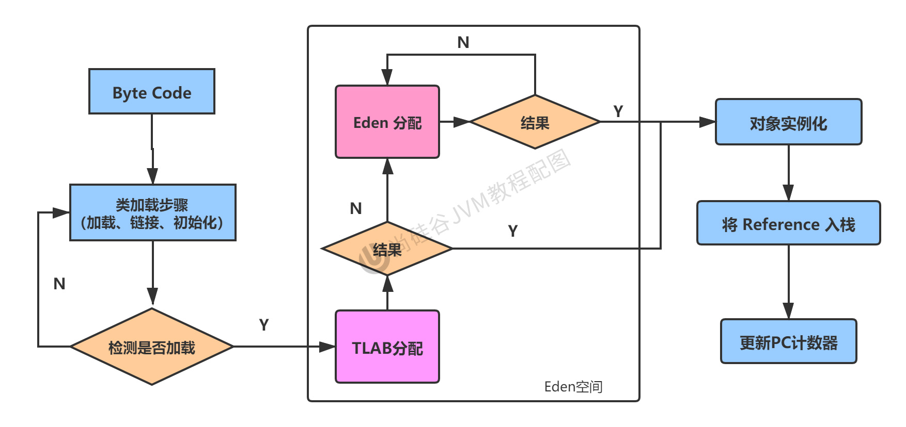

# Chapter08 堆(Heap)

## 8.1 堆的核心概述


* 红色的**方法区**(Method Area)和**堆**(Heap)对于一个进程而言，都是唯一的，也就是线程共享。
* 灰色的**程序计数器**，**本地方法栈**和**Java虚拟机栈**是每个线程各有一份。

堆(Heap)是JVM运行时数据区(Runtime Data Area)占用内存最大的一块区域。每一个运行的Java程序对应一个JVM进程，每一个JVM进程只存在一个堆区，它在JVM启动时被创建。JVM规范中规定堆区可以是物理上不连续的内存，但必须是逻辑上连续的内存。
* 一个JVM实例只存在一个堆内存，堆也是Java内存管理的核心区域。
* Java堆区在JVM启动的时候即被创建，其空间大小也就确定了，是JVM管理的最大一块内存空间。
  * 堆内存的大小是可以调节的。
* 《Java虚拟机规范》规定，堆可以处于物理上不连续的内存空间中，但在逻辑上，它应该被视为连续的。
* 所有的线程共享Java堆，在这里还可以划分线程私有的缓冲区(Thread Local Allocation Buffer, TLAB)
* 《Java虚拟机规范》中对Java堆的描述是: 所有的对象实例以及数组都应当在运行时分配堆上。(The heap is the runtime data area from which memory for all class instances and arrays is allocated)。
  * 我(shk)要说的是:"几乎"所有的对象实例都在这里分配内存。--从实际使用角度看。
* 数组和对象可能永远不会存储在栈上，因为栈帧中保存引用，这个引用指向对象或者数组在堆中的位置。
* 在方法结束后，堆中的对象不会马上被移除，仅仅在垃圾收集的时候才会被移除。
* 堆，是GC(Garbage Collection, 垃圾收集器)执行垃圾回收的重点区域。


* **栈**负责运行，解决程序的运行问题，即如何运行，或者说如何处理数据
* **堆**负责存储，解决的是数据存储的问题，即数据怎么放，放哪里
* 方法区

### 8.1.1 堆的核心概述: 内存细分
现代垃圾回收器大部分都基于分代收集理论设计，堆空间细分为:
* Java7及以前的堆内存逻辑上分为三部分: 新生区 + 养老区 + **永久区**
  * Young Generation Space
    * 又被划分为Eden区和Survivor区
  * Tenure Generation Space
  * **Permanent Space**
* Java8及以后内存逻辑上分为三部分: 新生区 + 养老区 + **元空间**
  * Young Generation Space
    * 又被划分为Eden区和Survivor区
  * Tenure Generation Space
  * **Meta Space**
* 约定: 新生去 <==> 新生代 <==> 年轻代； 养老区 <==> 老年区 <==> 老年代；永久区 <==> 永久代

**堆内存细节，自JDK8开始有区别:**


Example: `com.atguigu.java.HeapDemo`


## 8.2 设置堆内存大小与OOM
* Java堆区用于存储Java对象实例，那么堆的大小在JVM启动时就已经设定好了，大家可以通过选项`-Xmx`和`-Xms`来进行设置。
  * `-Xms`用于表示堆区的起始内存，等价于`-XX:InitialHeapSize`
  * `-Xmx`用于表示堆区的最大内存，等价于`-XX:MaxHeapSize`
  * `-Xmn`用于设置年轻代内存，一般不用，而是用`-XX:NewRatio`
* 一旦堆区中的内存大小超过`-Xmx`所指定的最大内存时，将会抛出`OutOfMemoryError`异常。
* 通常会将`-Xms`和`-Xmx`两个参数配置相同的值，其目的是为了能够在Java垃圾回收机制清理完堆区后，不需要再重新分隔计算堆区的大小，从而提高性能。
* 默认情况下: 
  * 初始内存大小: 物理内存大小/64
  * 最大内存大小: 物理内存大小/4


## 8.3 年轻代与老年代
* 存储在JVM中的Java对象可以划分为两类：
  * 一类是生命周期比较短的瞬时对象，这类对象的创建和消亡都非常迅速。
  * 另一类对象的生命周期却非常长，在某些极端的情况下还能够与JVM的生命周期保持一致。
* **Java堆区**进一步细分的话，可以划分为**年轻代(YoungGen)**和**老年代(OldGen)**。
* 其中年轻代又可以划分为Eden空间、Survivor0空间和Survivor1空间(有时也叫做from区和to区)
* 
* 1. 伊甸区(Eden): 存放大部分新创建对象。
  2. 幸存区(Survivor): 存放Minor GC之后，Eden区和幸存区(Survivor)本身没有被回收的对象。
  3. 老年区: 存放Minor GC之后且年龄计算器达到15依然存活的对象、Major GC和Full GC之后仍然存活的对象。
* 在HotSpot中，Eden空间和另外两个Survivor空间缺省所占比例是8:1:1
* 当然，开发人员可以通过选项`-XX:SurvivorRatio`调整这个比例。比如`-XX:SurvivorRatio=8`
* **几乎**所有的Java对象都是在Eden区中被new出来的。
* 绝大部分的Java对象的销毁都在新生代进行了。
  * IBM公司的专门研究表明，新生代中80%的对象都是"朝生夕死"的。
* 可以使用选项`-Xmn`设置新生代最大内存大小
  * 这个参数一般使用默认值就可以了

**下面这些参数开发中一般不会调:**
1. 配置新生代与老年代在堆结构中的占比:
   * 默认`-XX:NewRatio=2`，表示新生代占1，老年代占2，新生代占整个堆的1/3
   * 可以修改`-XX:NewRatio=4`，表示新生代占1，老年代占4，新生代占整个堆的1/5
   * 
2. 配置Eden空间和另外两个Survivor空间所占比例
   * 默认是`-XX:SurvivorRatio=8`
   * 
   * 

可以通过CLI查看`NewRatio`
```shell
➜  JVMTutorial git:(main) ✗ jps
92657 Jps
22930 Main
1332 
23481 
92303 EdenSurvivorTest
92302 Launcher
➜  JVMTutorial git:(main) ✗ jinfo -flag NewRatio 92303
-XX:NewRatio=2
➜  JVMTutorial git:(main) ✗ jinfo -flag SurvivorRatio 92303 
-XX:SurvivorRatio=8
➜  JVMTutorial git:(main) ✗ jstat -gc 92303
    S0C         S1C         S0U         S1U          EC           EU           OC           OU          MC         MU       CCSC      CCSU     YGC     YGCT     FGC    FGCT     CGC    CGCT       GCT   
    25600.0     25600.0         0.0         0.0     153600.0     110603.7     409600.0          0.0     4480.0      779.6     384.0      76.0      0     0.000     0     0.000     -         -     0.000
➜  JVMTutorial git:(main) ✗ 
```


## 8.4 图解对象分配过程
### 8.4.1 对象分配过程: 概述
为新对象分配内存是一件非常严谨和复杂的任务，JVM的设计者们不仅仅需要考虑内存如何分配、在哪里分配等问题，并且由于内存分配算法与内存回收算法密切相关，所以还需要考虑GC执行完后回收是否在内存空间中产生内存碎片。

1. new的对象先放在伊甸园区。此区有大小限制。
2. 当伊甸园区空间填满时，程序有需要创建对象，JVM的垃圾回收器将对伊甸园区进行垃圾回收(Minor GC)，将Eden区中不在被其他对象所引用的对象进行销毁。再加载新的对象放到Eden区。
   * 
3. 然后将Eden区中的剩余对象移动到Survivor0区。
4. 如果再次触发垃圾回收，此时上次幸存下来的放到Survivor0区的，如果没有被回收，就会放到Survivor1区。
5. 如果再次经历垃圾回收，此时会重新放回Survivor0区，接着再去Survivor1区。
6. 什么时候去老年区呢？可以设置次数，默认是15次。
   * 可以设置参数: `-XX:MaxTenuringThreshold=N`进行设置
7. 在老年去，相对悠闲。当老年区内存不足时，再次触发GC: Major GC，进行养老区的内存清理。
8. 若养老区执行了Major GC之后发现，依然无法进行对象的保存，就会产生OOM异常。
   * `java.lang.OutOfMemoryError: Java heap space`

**总结:**
* 针对幸存者区s0, s1区的总结: 复制之后有交换，谁空谁时to。
* 关于垃圾回收: 频繁在新生区收集，很少在养老区收集，几乎不在永久区/元空间收集。

### 8.4.2 对象分配的特殊情况


**内存溢出:** 当JVM无法申请到足够内存给堆空间或者没有足够的空间存储当前堆中的对象，就会出现`java.lang.OutOfMemoryError`。

### 8.4.3 常用的调优工具
* JDK命令行
* Eclipse: Memory Analyzer Tool
* Jconsole
* VisualVM
* Jprofiler
* Java Flight Recorder
* GCViewer
* GC Easy


## 8.5 Minor GC, Major GC, Full GC
JVM在进行GC时，并非每次都在对三个内存(新生代、老年代; 方法区)区域一起回收的，大部分时间回收的都是新生代。

针对HotSpot VM的实现，它里面的GC按照回收区域又分为:
* 部分收集: 不是完整收集整个Java堆的垃圾收集。其中又分为
  * 新生代收集(Minor GC/Young GC): 只是新生代(Eden, S0, S1)的垃圾回收
  * 老年代收集(Major GC/Old GC): 只是老年代的垃圾回收
    * 目前，只有CMS GC会有单独收集老年代的行为
    * 注意: 很多时候Major GC会和Full GC混淆使用，需要具体分辨是老年代回收还是整堆回收。
  * 混合收集(Mixed GC): 收集整个新生代以及部分老年代的垃圾收集。
    * 目前，只有G1 GC会有这种行为。
* 整堆收集(Full GC): 收集整个Java堆(新生代+老年代)和方法区的垃圾收集。

### 8.5.1 Minor GC
年轻代GC(Minor GC)触发机制:
* 当年轻代空间不足时，就会触发Minor GC，这里的年轻代满指的是Eden代满，Survivor满并不会触发GC。(每次Minor GC会清理年轻代的内存。) 
* 因为Java对象大多都具备朝生夕死的特性，所以Minor GC非常频繁，一般回收速度也会比较快。这一定义既清晰又易于理解。
* Minor GC会引发STW，暂停其他用户的线程，等垃圾回收结束，用户线程才会恢复运行。

### 8.5.2 Major GC
老年代GC(Major GC/Full GC)触发机制:
* 指发生在老年代的GC，对象从老年代消失时，我们说"Major GC"或"Full GC"发生了。
* 出现Major GC，经常会伴随至少依次的Minor GC(但非绝对的，在Parallel Scavenge收集器的收集策略里就有直接进行Major GC的策略选择过程)
  * 也就是在老年代空间不足时，会先尝试触发Minor GC。如果之后空间还不足，则触发Major GC
* Major GC的速度一般比Minor GC慢10倍以上，STW的时间更长。
* 如果Major GC后，内存还不足，就报OOM了。

### 8.5.3 Full GC
Full GC触发机制: 触发Full GC执行的情况有如下五种:
1. 调用`System.gc()`时，系统建议执行Full GC，但是不必然执行。
2. 老年代空间不足
3. 方法区空间不足
4. 通过Minor GC后进入老年代的平均大小大于老年代的可用内存
5. 由Eden区, survivor space0 (from space)区向survivor space1 (to space)区复制时，对象大小大于 to space可用的内存，则把对象转存到老年代，且老年代的可用内存大小小于该对象。

说明: full gc是开发或调优中尽量要避免的。这样暂停时间会短一些。

### 8.5.4 GC举例与日志分析
OOM通常都伴随着Full GC


Minor GC example: `[GC (Allocation Failure) [PSYoungGen: 2048K->512K(2560K)] 2048K->772K(9728K), 0.0007769 secs] [Times: user=0.00 sys=0.01, real=0.01 secs]`
* 2048K: 指的是Minor GC之前，新生代占用情况
* 512K: 指的是Minor GC之后，新生代的情况。由于包含了survivor区，所以并不为0
* 2560K: 新生代总空间大小。

## 8.6 堆空间分代思想
为什么需要把Java堆分代？不分代就不能正常工作吗？
* 经研究，不同对象的生命周期不同。70%-90%的对象是临时对象。
  * 新生代: 有Eden，两块大小相同的Survivor(又被称为from/to, s0/s1)构成，to总为空。
  * 老年代: 存放新生代中经历多次GC仍然存活的对象。
* 其实不分代完全可以，分代的唯一理由就是优化GC性能。如果没有分代，那所有的对象都在一起，就如同把一个学校的人都关在一个教室。GC的时候要找到哪些对象没用，这样就会对所有区域进行扫描。而很多时候对象都是朝生夕死的，如果分代的话，把新创建的对象放到某一地方，当GC的时候先把这块存储"朝生夕死"的对象进行回收，这样就会腾出很大的空间。


## 8.7 内存分配策略(或对象提升(Promotion)规则)
如果对象在Eden出生并经过第一次Minor GC后仍然存活，并且能被Survivor容纳的话，将会被移动到Survivor空间中，并将对象年龄设置为1。对象在Survivor区中每熬过一次Minor GC，年龄就增加1岁，当它的年龄增加到了一定程度(默认为15岁，其实每个JVM、每个GC都有不同)时，就会被晋升到老年代中。

对象晋升老年代的年龄阈值，可以通过选项`-XX:MaxTenuringThreshold`来设置。

**针对不同年龄段的对象分配原则如下所示:**
* 优先分配到Eden
* 大对象直接分配到老年代
  * 尽量避免程序中出现过多的大对象
* 长期存活的对象分配到老年代
* 动态对象年龄判断
  * 如果Survivor区中相同年龄的所有对象大小总和大于Survivor空间的一半，年龄大于或等于该年龄的对象可以直接进入老年代，无需等到MaxTenuringThreshold中要求的年龄。
* 空间分配担保
  * `-XX:HandlePromotionFailure`


## 8.8 为对象分配内存: TLAB
**为什么有TLAB(Thread Local Allocation Buffer):**
* 堆区是线程共享区域，任何线程都可以访问到堆区中的共享数据。
* 由于对象实例的创建在JVM中非常频繁，因此在并发环境下从堆区中划分内存空间是线程不安全的。
* 为了避免多个线程操作同一地址，需要使用加锁等机制，进而影响分配速度。

**什么是TLAB?:**
* 从内存模型而不是垃圾回收的角度，对Eden区域继续进行划分，JVM为每个线程分配了一个私有的缓存区域，它包含在Eden空间中。
* 多线程同时分配内存时，使用TLAB可以避免一系列的非线程安全问题。同时还能够提升内存分配的吞吐量，因此我们可以将这种内存分配方式称为**快速分配策略**。
* 所有OpenJDK衍生出来的JVM都提供了TLAB的设计。

**TLAB的再说明:**
* 尽管不是所有的对象实例都能够在TLAB中成功分配内存，但JVM确实是将TLAB作为内存分配的首选。
* 在程序中，开发人员可以通过选项`-XX:UseTLAB`设置是否开启TLAB空间。
* 默认情况下，TLAB空间的内存非常小，仅占整个Eden空间的1%，当然我们可以通过选项`-XX:TLABWasteTargetPercent`设置TLAB空间所占用Eden空间的百分比大小。
* 一旦对象在TLAB空间分配内存失败时，JVM就会尝试着通过使用加锁机制确保数据操作的原子性，从而直接在Eden空间中分配内存。

```shell
➜  JVMTutorial git:(main) ✗ jps
37136 Launcher
37137 TLABArgsTest
37219 Jps
1332 
27544 Main
23481 
➜  JVMTutorial git:(main) ✗ jinfo -flag UseTLAB 37137
-XX:+UseTLAB
```



## 8.9 小结堆空间的参数设置

* Example: `com.atguigu.java1.HeapArgsTest`
* 官网说明: [Java Platform, Standard Edition Tools Reference - Java](https://docs.oracle.com/javase/8/docs/technotes/tools/unix/java.html) JVM参数
* `-XX:+PrintFlagsInitial`: 查看所有的参数的默认初始值 
* `-XX:+PrintFlagsFinal`: 查看所有的参数的最终值(可能会存在修改，不再是初始值)
* `-Xms`: 初始堆空间内存(默认为物理内存的1/64)
* `-Xmx`: 最大堆空间内存(默认为物理内存的1/4)
* `-Xmn`: 设置新生代的大小(初始值及最大值)
* `-XX:NewRatio`: 配置新生代与老年代在堆结构的占比
* `-XX:SurvivorRatio`: 设置新生代中Eden和S0/S1空间比例
* `-XX:MaxTenuringThreshold`: 设置新生代垃圾的最大年龄
* `-XX:+PrintGCDetails`: 输出纤细的GC处理日志
  * 打印GC简要信息: `-XX:PrintGC` or `-verbose:gc`
* `-XX:HandlePromotionFailure`: 是否分配空间分配担保

在发生Minor GC之前，虚拟机会检查老年代最大的可用连续空间是否大于新生代所有对象的总空间。
* 如果大于，则此次Minor GC是安全的
* 如果小于，则虚拟机会查看`-XX:HandlePromotionFailure`设置值是否允许担保失败
  * 如果`HandlePromotionFailure=true`，那么会继续检查老年代最大可用连续空间是否大于历次晋升失败到老年代的对象的平均大小。
    * 如果大于，则尝试一次Minor GC，但这次Minor GC依然是有风险的。
    * 如果小于，则改为进行一次Full GC。
  * 如果`HandlePromotionFailure=false`，则改为进行一次Full GC。

在JDK6 Update24 (i.e. JDK7)之后，`HandlePromotionFailure`参数不会再影响到虚拟机的空间分配担保策略，观察OpenJDK中的源码变化，虽然源码中还定义了`HandlePromotionFailure`参数，但是在代码中已经不会再使用它。JDK6 Update24之后的规则变为**只要老年代的连续空间大于新生代对象总大小**或者**历次晋升的平均大小就会进行Minor GC**，否则将进行Full GC。


## 8.10 堆是分配对象的唯一选择吗？
在《深入理解Java虚拟机》中关于Java堆内存有这样一段描述:
> 随着JIT编译器的发展与逃逸分析技术逐渐成熟，**栈上分配、标量替换优化技术**将会导致一些微妙的变化，所有的对象都分配到堆上也渐渐变得不那么"绝对了"。
> 
> 在Java虚拟机中，对象是在Java堆中分配内存的，这是一个普遍的常识。但是，有一种特殊情况，那就是如果经过逃逸分析(Escape Analysis)后发现，一个对象没有逃逸出方法的话，那么就可能会被优化成栈上分配。这样就无需在堆上分配内存，也无须进行垃圾回收。这也是最常见的堆外存储技术。
> 
> 此外，前面提到的基于OpenJDK深度定制的TaoBaoVM，其中创新性的GCIH (GC Invisible Heap)技术实现off-heap，将生命周期较长的Java对象从heap中移至Heap外，并且GC不能管理GCIH内部的Java对象，以此达到降低GC的回收率和提升GC的回收效率的目的。

### 8.10.1 逃逸分析概述
* 如何将堆上的对象分配到栈，需要使用逃逸分析手段。
* 这是一种可以有效减少Java程序中同步负载和内存堆分配压力的跨函数全局数据流分析算法。
* 通过逃逸分析，Java HotSpot编译器能够分析出一个新的对象的引用使用范围从而决定是否要将这个对象分配到堆上。
* 逃逸分析的基本行为就是分析对象动态作用域:
  * 当一个对象在方法中被定义后，对象只在方法内部使用，则认为没有发生逃逸。没有发生逃逸的对象，则可以分配到栈上，随着方法执行的结束，栈空间就被移除了。
  * 当一个对象在方法被定义后，它被外部方法所引用，则认为发生了逃逸。例如作为调用参数传递到其他地方。

```java
public static StringBuffer createStringBuffer(String s1, String s2) {
    StringBuffer sb = new StringBuffer();
    sb.append(s1);
    sb.append(s2);
    return sb;
}
```
* 当上述方法在别处被调用时，`StringBuffer sb`就有可能在这个方法外部被调用，因此可能发生逃逸。

改进
```java
public static String createStringBuffer(String s1, String s2) {
    StringBuffer sb = new StringBuffer();
    sb.append(s1);
    sb.append(s2);
    return sb.toString();
}
```
* `StringBuffer sb`只在这个方法内部使用，而不会被外部方法用到。

**参数设置:**
* 在JDK6u24版本之后，HotSpot中默认已经开启逃逸分析。
* 如果使用的是较早的版本，开发人员则可以通过
  * 选项`-XX:+DoEscapeAnalysis`显式开启逃逸分析
  * 通过选项`-XX:+PrintEscapeAnalysis`查看逃逸分析的筛选结果。

**结论:** 开发中能使用局部变量的，就不要使用在方法外定义。

#### 1. 逃逸分析: 代码优化
使用逃逸分析，编译器可以对代码做如下优化:
1. 栈上分配。将堆分配转化为栈分配。如果一个对象在子程序中被分配，要使指向该对象的指针永远不会逃逸，对象可能是栈分配的候选，而不是堆分配。
2. 同步省略。如果一个对象被发现只能从一个线程被访问，那么对这个对象的操作可以不考虑同步。
3. 分离对象或标量替换。有的对象可能不需要作为一个连续的内存结构存在也可以被访问到，那么对象的部分(或全部)可以不存储在内存，而是存储在CPU寄存器中。


#### 2. 代码优化之栈上分配
* JIT编译器在编译期间根据逃逸分析的结果，发现如果对象并没有逃逸出方法的话，就可能被优化成栈上分配。分配完成后，继续在调用栈内执行，最后线程结束，栈空间被回收，局部变量对象也被回收。这样就无须进行垃圾回收了。
* 常见的栈上分配场景:
  * 在逃逸分析中，已经说明了。分别是给成员变量赋值、方法返回值、实例引用传递。
* Example: `com.atguigu.java2.StackAllocation`

#### 3. 代码优化之同步省略
* 线程同步的代价是相当高的，同步的后果是降低并发行和性能。
* 在动态编译同步代码块的时候，JIT编译器可以借助逃逸分析来**判断同步代码块所使用的对象是否只能够被一个线程访问而没有被发布到其他线程**。如果没有，那么JIT编译器在编译这个同步代码块的时候就会取消对这部分代码的同步。这样就能大大提供并发行和性能。这个取消同步的过程就叫做同步省略，也叫做**锁消除**。
* Example: `com.atguigu.java2.SynchronizedTest.f`
  * 通过jclasslib查看class文件时，还是可以看到锁的，`monitorenter, monitorexit`，只是加载到内存时运行时，才会考虑优化掉。

#### 4. 代码优化之标量替换
* 标量(Scalar)是指一个无法再分解成更小的数据的数据。Java中的原始数据类型就是标量。
* 相对的，那些还可以被分解的数据叫做聚合量(Aggregate)，Java中对象就是聚合量，因为它可以分解成其他聚合量和标量。
* 在JIT阶段，如果讲过逃逸分析，发现其中一个对象不会被外界访问的话，那么经过JIT优化，就会把这个对象拆解成若干个其中包含若干个成员变量来替代。这个过程就是**标量替换**。
* 标量替换参数设置:
  * 参数`-XX:+EliminateAllocations`: 开启了标量替换(默认打开)，允许将对象分散分配在栈上。
* Example: `com.atguigu.java2.ScalarReplace.main`
* 上例代码在`main()`函数中进行了1亿次alloc。调用进行对象创建，由于User对象实例需要占据约16字节的空间，因此累计分配空间达到近1.5GB。如果堆空间小于这个值，就必然发生GC。使用如下参数运行上述代码: `-server -Xmx100m -Xms100m -XX:+DoEscapeAnalysis -XX:+PrintGC -XX:-EliminateAllocations`
  * `-server`: 启动Server模式，因为在Server模式下，才可以启用逃逸分析。
  * `-XX:+DoEscapeAnalysis`: 启用逃逸分析
  * `-Xmx10m`: 指定了堆空间最大为10MB
  * `-XX:PrintGC`: 打印GC日志
  * `-XX:+EliminateAllocations`: 开启了标量替换(默认打开)，允许将对象打散分配在栈上，比如对象拥有`id`和`name`两个字段，那么这两个字段将会被视为两个独立的局部变量进行分配。
  * `java -version`: 默认在64bit电脑上启动就是Server模式


#### 5. 逃逸分析小结: 逃逸分析并不成熟
* 关于逃逸分析的论文在1999年就已经发表了，但知道JDK 1.6才有实现，而且这项技术到如今也并不是十分成熟。
* 其根本原因就是无法保证逃逸分析的性能消耗一定高于其他的消耗。虽然经过逃逸分析可以做标量替换，栈上分配，和锁消除。但是逃逸分析自身也是需要进行一系列复杂的分析的，这其实也是一个相对耗时的过程。
* 一个极端的例子，就是经过逃逸分析之后，发现并没有一个对象是不逃逸的。那这个逃逸分析的过程就是白白的资源消耗。
* 虽然这项技术并不十分成熟，但是它也是即时编译器优化技术中一个十分重要的手段。
* 注意到有一些观点，认为通过逃逸分析，JVM会在栈上分配那些不会逃逸的对象，这在理论上是可行的，但是取决于JVM设计者的选择。Oracle Hotspot JVM中就并未这么做，这一点在逃逸分析相关的文档中已经说明了，所以可以明确所有的对象实例都是创建在堆上的。
* 目前很多书籍还是基于JDK 7以前的版本，JDK已经发生了很大变化，intern字符串的缓存和静态变量曾经都被分配在永久代上，而永久代已经被元数据区取代。但是intern字符串缓存和静态变量并不是被转移到元数据区，而是直接在堆上分配，所以这一点同样符合前面一点的结论: 对象实例都是分配在堆上。


## 本章小结
* 年轻代是对象诞生、成长、消亡的区域，一个对象在这里产生、应用，最后被垃圾回收器收集、结束生命。
* 老年代放置长生命周期的对象，通常都是从Survivor区域筛选拷贝过来的Java对象。当然，也有特殊情况，我们知道普通的对象会被分配在TLAB上；如果对象较大，JVM会试图直接分配在Eden其他位置上；如果对象太大，完全无法在新生代找到足够长的连续空间，JVM就会直接分配到老年代。
* 当GC只发生在年轻代中，回收年轻代的行为被称为Minor GC。当GC发生在老年代时则被称为Major GC或者Full GC，即很多老年代中垃圾回收发生的频率大大低于年轻代。

## Reference
* 宋红康
* [Java HotSpot VM](https://www.oracle.com/java/technologies/javase/vmoptions-jsp.html)
* [Java Platform, Standard Edition Tools Reference - index](https://docs.oracle.com/javase/8/docs/technotes/tools/unix/index.html)
* [Java Platform, Standard Edition Tools Reference - Java](https://docs.oracle.com/javase/8/docs/technotes/tools/unix/java.html) JVM参数
* [第十二篇 JVM之运行时数据区<8>: Java堆](https://www.cnblogs.com/zhexuejun/p/15705428.html)
* [What Is a TLAB or Thread-Local Allocation Buffer in Java?](https://www.baeldung.com/java-jvm-tlab)
* [终于搞明白Java8内存结构](https://cloud.tencent.com/developer/article/1869201)