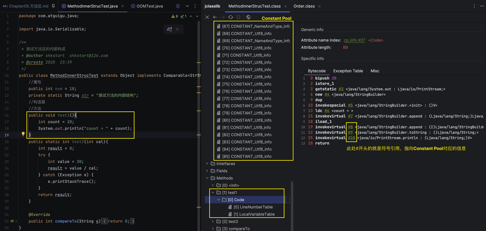
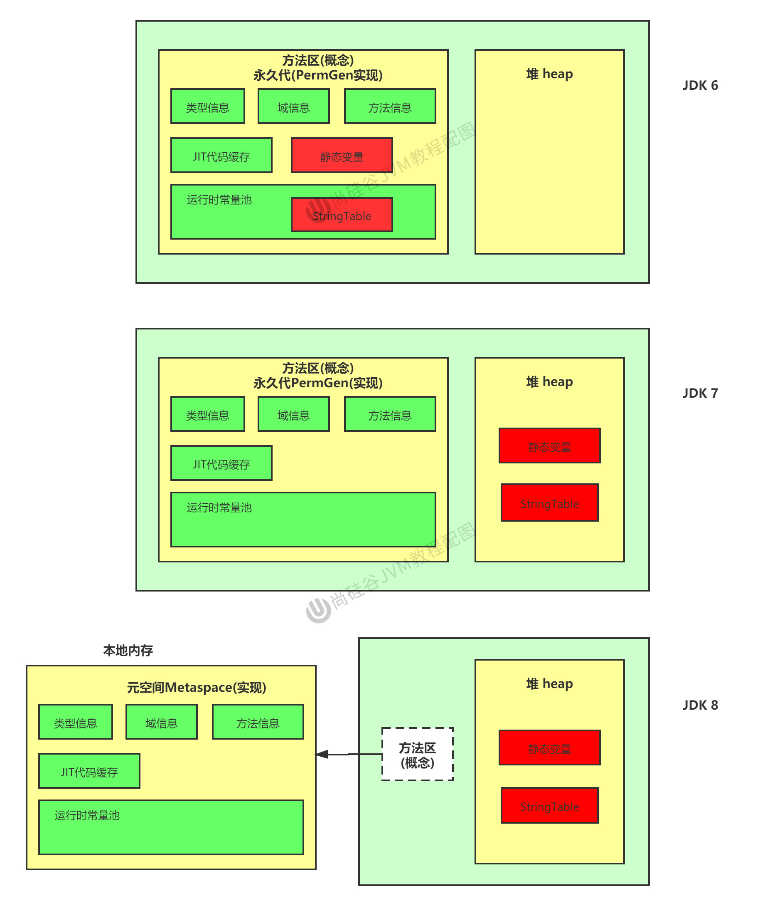
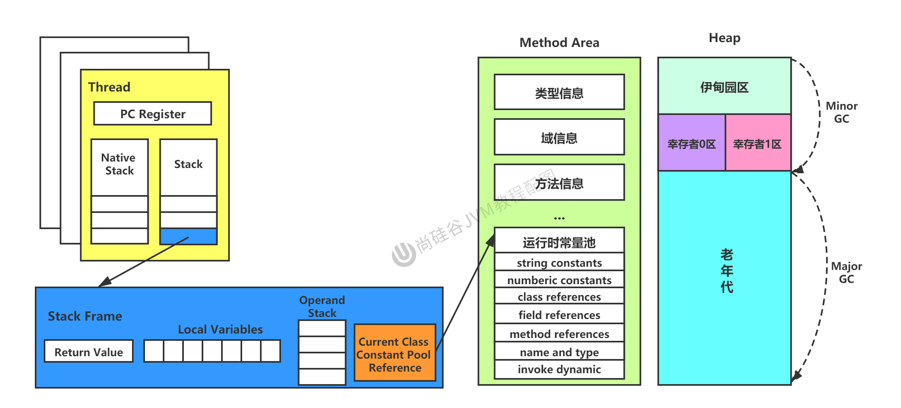

# Chapter09. 方法区

## 9.1 栈、堆、方法区的交互关系


* 线程共享的区域：堆(heap)和元空间(meta space)
* 堆、元空间，既有GC又有OOM
* 虚拟机栈、本地方法栈，有StackOverflowError，没有GC
* 程序计数器，既没有异常，也没有GC


* `Person`类的结构加载到方法区
* `person`变量加载到Java虚拟机栈, frame 的LocalVariableTable 中
* `new Person();`创建出的实例位于堆中


## 9.2 方法区的理解
### 9.2.1 方法区在哪里？
《Java虚拟机规范》中明确说明: “尽管所有的方法区逻辑上是属于堆的一部分，但一些简单的实现可能不会选择去进行垃圾回收或着进行压缩。”但对于HotSpot JVM而言，方法区还有一个别名叫做**Non-Heap(非堆)**，目的就是要和堆分开。

**所以，方法区看作是一块独立于Java堆的内存空间。**


* 方法区与Java堆一样，是各个线程共享的内存区域。
* 方法区在JVM启动的时候被创建，并且它的实际的物理内存空间中和Java堆区一样都可以是不连续的。
* 方法区的大小，跟堆空间一样，可以选择固定大小或者可扩展。
* 方法区的大小决定了系统可以保存多少个类，如果定义了太多的类，导致方法区溢出，虚拟机同样会抛出内存溢出错误: `java.lang.OutOfMemoryError: PermGen Space` or `java.lang.OutOfMemoryError: Metaspace`
  * 加载大量的第三方的jar包；Tomcat部署的工程过多(30-50个)；大量动态地生成反射类
* 关闭JVM就会释放这个区域的内存


### 9.2.2 HotSpot中方法区的演进
* 在JDK7及以前，习惯上把方法区，称为**永久代**。从JDK8开始，使用"元空间"取代了"永久代"。
  * 
* 本质上，方法区和永久代并不等价。仅是对HotSpot而言。《Java虚拟机规范》对如何实现方法区，不做统一要求。例如: BEA JRockit/IBM J9中不存在永久代的概念。
  * 现在看来，当年使用永久代，不是好的idea。导致Java程序更容易OOM(超过`-XX:MaxPermSize`上限)
* 而到了JDK8，终于完全废弃了永久代的概念，该用与JRockit、J9一样的**本地内存实现的元空间**(Metaspace)来替代
* 元空间的本质和永久代类似，都是对JVM虚拟机规范中方法区的实现。不过元空间与永久代最大的区别在于: **元空间不在虚拟机设置的内存中，而是使用了本地内存。**
* 永久代、元空间二者并不只是名字变了，内部结构也调整了。
  * 
* 根据《Java虚拟机规范》的规定，如果方法区无法满足新的内存分配需求时，将抛出OOM异常。

```shell
➜  ~ jps
32553 Main
51945 Launcher
51946 Demo01MethodArea
90543 Main
52335 Jps
➜  ~
➜  ~ jinfo -flag MetaspaceSize 51946
-XX:MetaspaceSize=21807104
➜  ~
➜  ~ jinfo -flag MaxMetaspaceSize 51946
-XX:MaxMetaspaceSize=18446744073709535232
```
* 21807104 (Bytes) = 20 * 1024 * 1024 (B) = 20 * 1024 (KB) = 20 (MB)
* 18446744073709535232 (Bytes) ~= 16EB


## 9.3 设置方法区大小与OOM
### 9.3.1 方法区大小设置
方法区的大小不必是固定的，JVM可以根据应用的需要动态调整。
* JDK7及以前: `-XX:PermSize=100m -XX:MaxPermSize=100m`
* JDK8及以后
  * 元数据区大小可以使用参数`-XX:MetaspaceSize`和`-XX:MaxMetaspaceSize`指定，替代上述原有的两个参数。
  * 默认值依赖于平台。Windows下，`-XX:MetaspaceSize`是21M，`-XX:MaxMetaspaceSize`的值是-1，即没有限制。
  * 与永久代不同，如果不指定大小，默认情况下，虚拟机会耗尽所有的可用的系统内存。如果元数据区发生溢出，虚拟机一样会抛出异常`OutOfMemoryError: Metaspace`
  * `-XX:MetaspaceSize`: 设置初始的元空间大小。对于一个64bit的服务器段JVM来说，其默认的`-XX:MetaspaceSize`值为21MB。这就是初始的高水位线，一旦触及这个水位线，Full GC将会被触发并卸载没用的类(即这些类对应的加载器不在存活)，然后这个高水位线将会重置。新的高水位线的值取决于GC后释放了多少元空间。如果释放的空间不足，那么在不超过MaxMetaspaceSize时，适当提高该值。如果释放空间过多，则适当降低该值。
* 如果初始化的高水位线设置过低，上述高水位线调整情况会发生很多次。通过垃圾回收器的日志可以观察到Full GC多次调用。为了避免频繁GC，建议将`-XX:MetaspaceSize`设置为一个相对较高的值。

### 9.3.2 OOM举例
* Example: `com.atguigu.java.OOMTest`
* ```shell
  3331
  Exception in thread "main" java.lang.OutOfMemoryError: Compressed class space
  at java.lang.ClassLoader.defineClass1(Native Method)
  at java.lang.ClassLoader.defineClass(ClassLoader.java:756)
  at java.lang.ClassLoader.defineClass(ClassLoader.java:635)
  at com.atguigu.java.OOMTest.main(OOMTest.java:29)
  
  Process finished with exit code 1
  ```
* 宋红康视频中抛出的异常是`java.lang.OutOfMemoryError: Metaspace`

### 9.3.3 如何解决这些OOM？
1. 要解决OOM异常或heap space的异常，一般的手段是首先通过内存映像分析工具(如Eclipse Memory Analyzer)对dump出来的堆转储快照进行分析，重点是确认内存中的对象是否是必要的，也就是要线分析清楚到底是出现了内存泄漏(Memory Leak)还是内存溢出(Memory Overflow)。
2. 如果是内存泄漏，可进一步通过工具查看泄漏对象到GC Roots的引用链。于是就能找到泄漏对象是通过怎样的路径与GC Roots相关联并导致垃圾回收器无法自动回收它们的。掌握了泄漏对象的类型信息，以及GC Roots引用链的信息，就可以比较准确地定位出泄漏代码的位置。
3. 如果不存在内存泄漏，换句话说就是内存中的对象确实都还必须活着，那就应当查看虚拟机的堆参数(`-Xms, -Xmx`)，与机器物理内存对比看是否还可以调大，从代码上检查是否存在某些对象生命周期过长、持有状态时间过长的情况，尝试减少程序运行期的内存消耗。


## 9.4 方法区的内部结构


### 9.4.1 方法区(Method Area)存储了什么？
* 《深入理解Java虚拟机》书中对方法区(Method Area)存储内容描述如下: **它用于存储已被虚拟机加载的类型信息、常量、静态变量、即时编译器编译后的代码缓存等**。
  * 
  
1. **类型信息**: 对每个加载的类型(类class，接口interface，枚举enum，注解annotation)，JVM必须在方法区中存储以下类型信息:
   1. 这个类型的完整有效名称(全名=包名.类名)
   2. 这个类型直接父类的完整有效名(对于interface或是java.lang.Object，都没有父类)
   3. 这个类型的修饰符(public, abstract, final的某个子集)
   4. 这个类型直接接口的一个有序列表
2. **域(Field)信息**:
   1. JVM必须在方法区中保存类型的所有域的相关信息以及域的声明顺序
   2. 域的相关信息包括: 域名称，域类型，域修饰符(public, private, protected, static, final, volatile, transient的某个子集)
3. **方法(Method)信息**: JVM必须保存所有方法的以下信息，同域信息一样包括声明顺序:
   1. 方法名称
   2. 方法的返回类型(或 void)
   3. 方法参数的数量和类型(按顺序)
   4. 方法的修饰符(public, private, protected, static, final, synchronized, native, abstract的一个子集)
   5. 方法的字节码(bytecodes)，操作数栈、局部变量表及大小(abstract和native方法除外)
   6. 异常表(abstract和native方法除外)
      * 每个异常的开始位置、结束位置、代码处理在程序计数器中的偏移地址、被捕获的异常类的常量池索引
4. **non-final的类变量**:
   1. 静态变量和类关联在一起，随着类的加载而加载，它们成为类数据在逻辑是那个的一部分。
   2. 类变量被类的所有实例共享，即使没有类实例时你也可以访问它。
   3. Example: `com.atguigu.java.MethodAreaTest`
5. **补充说明**: 全局常量。
   1. 被声明为final的类变量(`static final`)的处理方法则不同，每个全局常量在编译的时候就会被分配了。
   2. ```shell
      public static int count;  // static 变量 (non-final)
      descriptor: I
      flags: ACC_PUBLIC, ACC_STATIC
        
      public static final int number; // static final 变量
      descriptor: I
      flags: ACC_PUBLIC, ACC_STATIC, ACC_FINAL
      ConstantValue: int 2
      ```

### 9.4.2 运行时常量池 vs 常量池
* 方法区，内部包含了**运行时常量池(Runtime Constant Pool)**。
* 字节码文件，内部包含了**常量池(Constant Pool)**。
* 要弄清楚方法区，需要理解清楚ClassFile，因为加载类的信息都在方法区。
* 要弄清楚方法区的运行时常量池，需要理解清楚ClassFile中的常量池。
  * https://docs.oracle.com/javase/specs/jvms/se8/html/jvms-4.html

一个有效的字节码文件中除了包含了版本信息、字段、方法以及接口等描述信息外，还包含一项信息那就是常量池表(Constant Pool Table)，包括各种字面量和对类型、域和方法的符号引用。

#### 为什么需要常量池？
一个Java源文件中的类、接口，编译后产生一个字节码文件。而Java中的字节码需要数据支持，通常这种数据会很大以至于不能直接存到字节码里，换另一种方式，可以存到常量池，这个字节码包含了指向常量池的引用。在动态链接的时候会用到运行时常量池。
* 

#### 常量池小结
常量池，可以看作是一张表，虚拟机指令根据这种常量表找到要执行的类名、方法名、参数类型、字面量等类型。

#### 运行时常量池
* 运行时常量池(Runtime Constant Pool)是方法区的一部分。
* 常量池表(Constant Pool Table)是class文件的一部分，用于存放编译期生成的各种字面量与符号引用，这部分内容在类加载后存放在方法区的运行时常量池中。
* 运行时常量池，在加载类和接口到虚拟机后，就会创建对应的运行时常量池。
* JVM为每个已加载的类型(类or接口)都维护一个常量池。池中的数据项像数组项一样，是通过索引访问的。
* 运行时常量池中包含多个不同的常量，包括编译期就已经明确的数值字面量，也包括到运行期解析后才能获得的方法或者字段引用。此时不再是常量池中的符号地址，这里替换为真实地址。
  * 运行时常量池，相对于Class文件常量池的另一重要特征是: 具备动态性。
    * `String.intern()`
* 运行时常量池类似于传统编程语言中的符号表(symbol table)，但是它所包含的数据却比符号表更加丰富一些。
* 当创建类或接口的运行时常量池时，如果构造运行时常量池所需的内存空间超过了方法区所能提供的最大值，则JVM会抛出`OutOfMemoryError`异常。

## 9.5 方法区使用举例
* Example: `com.atguigu.java.MethodAreaDemo`
* [Youtube: 96 图示举例方法区的使用](https://www.youtube.com/watch?v=qkUOVYDw-tY&list=PLmOn9nNkQxJHNSznBikUX5sMv_XwDUYz4&index=96)


## 9.6 方法区的演进细节
1. 首先明确: 只有HotSpot虚拟机才有永久代。BEA JRockit、IBM J9等来说，是不存在永久代的概念的。原则上如何实现方法区属于虚拟机实现细节，不受《Java虚拟机规范》管束，并不要求统一。
2. HotSpot中方法区的变化: 
   1. jdk1.6及之前: 有永久代(permanent generation)，静态变量存放在永久代上。
   2. jdk1.7: 有永久代，但已经逐步"去永久代"，字符串常量池、静态变量移除，保存在堆中。
   3. jdk1.8及以后: 无永久代，类型信息、字段、方法、常量保存在本地内存的元空间，但字符串常量池、静态变量仍在堆。
3. 
   1 在JDK7的时候，把静态常量和StringTable放到的堆中。
   2. 在JDK8的时候，放方法区移出虚拟机内存，直接使用本地内存，此时方法区就不受虚拟机内存的限制了。

### 9.6.1 永久代为什么要被元空间替换？
* https://openjdk.org/jeps/122 (Motivation) (可以学学写Tech Doc)
* 随着Java8的到来，HotSpot VM中再也见不到永久代了。但是这并不意味这类的元数据信息也消失了。这些数据被移动到了一个与堆不相连的本地内存，这个区域叫做元空间(Metaspace)。
* 由于类的元数据分配在本地内存中，元空间的最大可分配空间就是系统可用内存空间。
* 这项改动是必要的，原因有:
  1. 为永久代设置空间大小是很难确定的。在某些场景下，如果动态加载类过多，容易长生Perm区的OOM。比如某个实际Web工程中，因为功能点比较多，在运行过程中，要不断动态加载很多类，经常出现致命错误。而元空间和永久代之间最大的区别在于: 元空间并不在虚拟机中，而是使用本地内存。因此，默认情况下，元空间的大小仅受本地内存限制。
  2. 对永久代进行调优是很困难的。

### 9.6.2 StringTable为什么要调整位置?
JDK7中将StringTable放到了堆空间中。因为永久代的回收效率很低，在Full GC的时候才会触发。而Full GC是老年代的空间不足、永久代不足时才会触发。这就导致StringTable回收效率不高。而开发中会有大量的字符串被创建，回收效率低，导致永久代内存不足。放到堆里，能即时回收。

### 9.6.3 静态变量放在哪里？
* 工具: `jhsdb`
* ```shell
  ➜  java1 git:(main) ✗ jhsdb
  clhsdb              command line debugger
  hsdb                ui debugger
  debugd --help       to get more information
  jstack --help       to get more information
  jmap   --help       to get more information
  jinfo  --help       to get more information
  jsnap  --help       to get more information
  ```
* Example: `com.atguigu.java1.StaticObjTest`
  * `staticObj`随着Test的类型信息放在方法区
  * `instanceObj`随着Test的对象实例存放在Java堆中
  * `localObject`则是存放在`foo()`方法栈帧的局部变量表中
  * 测试发现: 三个对象的数据在内存中的地址落在Eden区范围内，所以结论: 只要是对象实例，必然会在Java堆中分配。
  * JDK7及其以后版本的HotSpot虚拟机选择把静态变量与类型在Java语言一端的映射Class对象存放在一起，存储于Java堆之中。


## 9.7 方法区的垃圾回收
有些人认为方法区()是没有垃圾收集行为的，其实不然。《Java虚拟机规范》对方法区的约束是非常宽松的，提到过可以不要求虚拟机在方法区中实现垃圾收集。事实上也确实有未实现或未能完整实现方法区类型卸载的收集器存在(如JDK11时期的ZGC收集器就不支持类卸载)。

一般来说这个区域的回收效果比较难令人满意，尤其是类型的卸载，条件相当苛刻。但是这部分区域的回收有时候确实是必要的。以前Sun公司的Bug列表中，曾出现过若干个严重的Bug就是由于低版本的HotSpot虚拟机对此区域未完全回收而导致内存泄漏。

方法区的垃圾收集主要回收两部分内容: **常量池中废弃的常量**和**不再使用的类型**。

* 先来说说方法区内常量池之中主要存放的两大类常量: 字面量和符号引用。字面量比较接近Java语言曾名的常量概念，如文本字符串、被声明为final的常量值等。而符号引用则属于编译原理方法的概念，包括下面三类常量:
  1. 类和接口的全限定名
  2. 字段的名称和描述符
  3. 方法的名称和描述符
* HotSpot虚拟机对常量池的回收策略是很明确的，只要常量池中的常量没有被任何地方引用，就可以被回收。
* 回收废弃常量与回收Java堆中的对象非常类似。
* 判定一个常量是否"废弃"还是相对简单的，而要判定一个类型是否属于"不再被使用的类"的条件就比较苛刻了。需要同时满足下面三个条件:
  * 该类所有的实例都已经被回收，也就是Java堆中不存在该类及其任何派生子类的实例。
  * 加载该类的类加载器已经被回收，这个条件除非是经过精心设计的可替换类加载器的场景，如OSGi，JSP的重加载等，否则通常是很难达成的。
  * 该类对应的`java.lang.Class`对象没有在任何地方被引用，无法在任何地方通过反射访问该类的方法。
* Java虚拟机被允许堆满足上述三个条件的无用类进行回收，这里说的仅仅是"被允许"，而并不是和对象一样，没有引用了就必然被回收。关于是否要堆类型进行回收，HotSpot虚拟机提供了`-Xnoclassgc`参数进行控制，还可以使用`-verbose:class`以及`-XX:+TraceClass-Loading, -XX:TraceClassUnloading`查看类加载和卸载信息。
* 在大量使用发射、动态代理、CGLib等字节码框架，动态生成JSP以及OSGi这类频繁自定义类加载器的场景中，通常都需要Java虚拟机具备类型卸载的能力，以保证不会堆方法区造成过大的内存压力。


## 9.8 总结



## Reference
* 官方文档: https://docs.oracle.com/javase/specs/jvms/se8/html/jvms-2.html#jvms-2.5.4
* 官方文档: https://docs.oracle.com/javase/8/docs/technotes/tools/unix/java.html (`-XX:PermSize=size, -XX:MetaspaceSize=size`)
* https://docs.oracle.com/javase/8/docs/technotes/tools/unix/java.html
* 官方文档 The class File Format: https://docs.oracle.com/javase/specs/jvms/se8/html/jvms-4.html
* https://openjdk.org/jeps/122