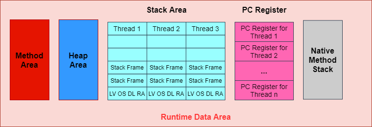
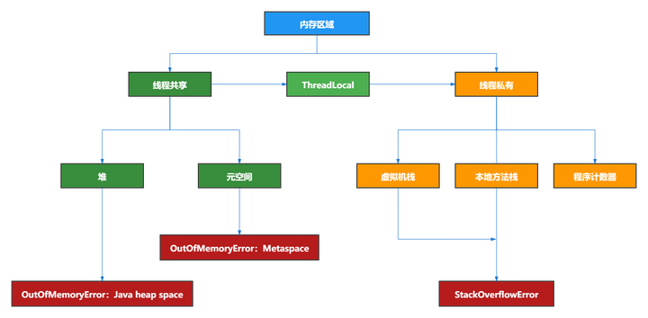
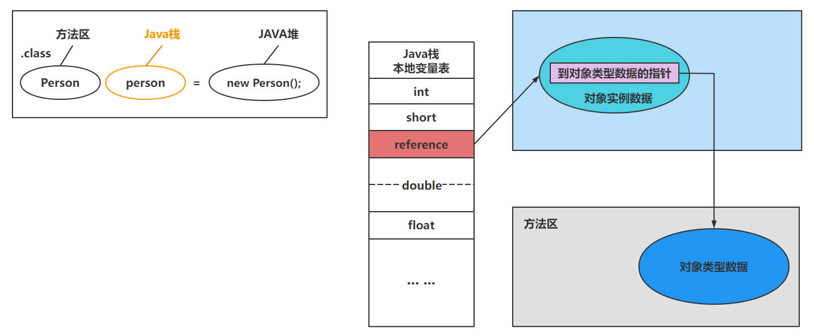
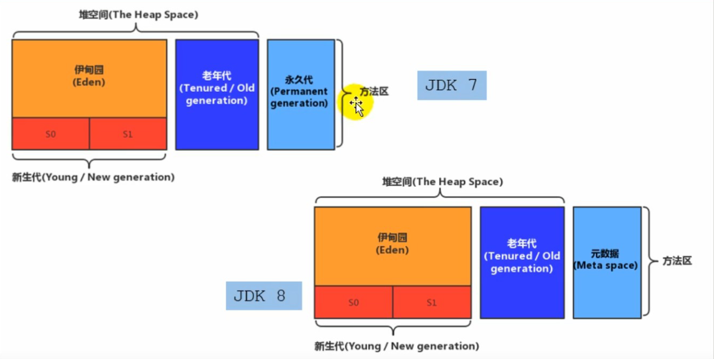
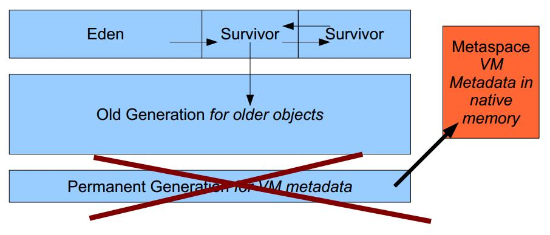
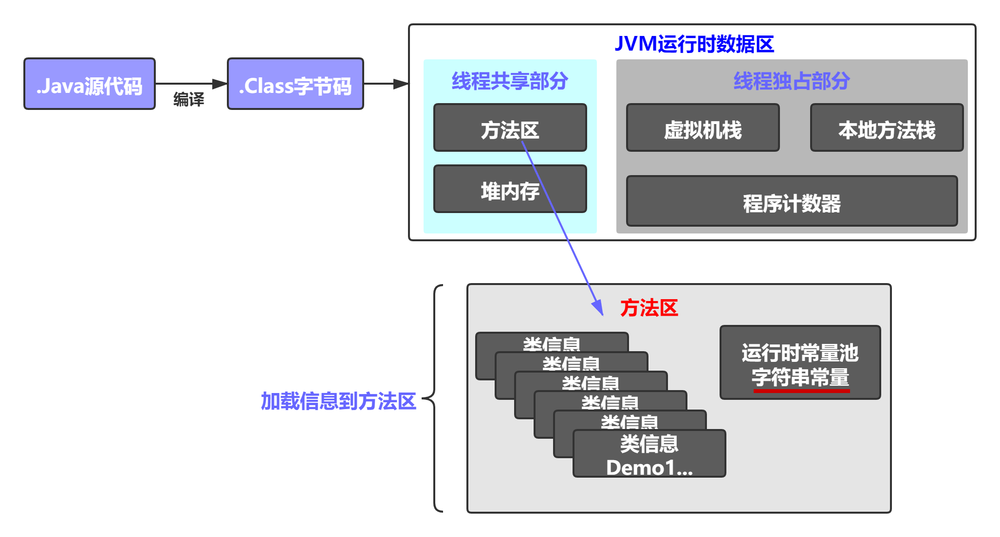

# Chapter09. 方法区

## 9.1 栈、堆、方法区的交互关系



* 堆、元空间，既有GC又有OOM
* 虚拟机栈、本地方法栈，有StackOverflowError，没有GC
* 程序计数器，既没有异常，也没有GC



* `Person`类的结构加载到方法区
* `person`变量加载到Java虚拟机栈
* `new Person();`创建出的实例位于堆中

## 9.2 方法区的理解
### 9.2.1 方法区在哪里？
《Java虚拟机规范》中明确说明: “尽管所有的方法区逻辑上是属于堆的一部分，但一些简单的实现可能不会选择去进行垃圾回收或着进行压缩。”但对于HotSpot JVM而言，方法区还有一个别名叫做**Non-Heap(非堆)**，目的就是要和堆分开。

**所以，方法区看作是一块独立于Java堆的内存空间。**


* 方法区与Java堆一样，是各个线程共享的内存区域。
* 方法区在JVM启动的时候被创建，并且它的实际的物理内存空间中和Java堆区一样都可以是不连续的。
* 方法区的大小，跟堆空间一样，可以选择固定大小或者可扩展。
* 方法区的大小决定了系统可以保存多少个类，如果定义了太多的类，导致方法区溢出，虚拟机同样会抛出内存溢出错误: `java.lang.OutOfMemoryError: PermGen Space` or `java.lang.OutOfMemoryError: Metaspace`
  * 加载大量的第三方的jar包；Tomcat部署的工程过多(30-50个)；大量动态地生成反射类
* 关闭JVM就会释放这个区域的内存

### 9.2.2 HotSpot中方法区的演进
* 在JDK7及以前，习惯上把方法区，称为永久代。从JDK8开始，使用"元空间"取代了"永久代"。
  * 
* 本质上，方法区和永久代并不等价。仅是对HotSpot而言。《Java虚拟机规范》对如何实现方法区，不做统一要求。例如: BEA JRockit/IBM J9中不存在永久代的概念。
  * 现在看来，当年使用永久代，不是好的idea。导致Java程序更容易OOM(超过`-XX:MaxPermSize`上限)
* 而到了JDK8，终于完全废弃了永久代的概念，该用与JRockit、J9一样的本地内存实现的元空间(Metaspace)来替代
* 元空间的本质和永久代类似，都是对JVM虚拟机规范中方法区的实现。不过元空间与永久代最大的区别在于: **元空间不在虚拟机设置的内存中，而是使用了本地内存。**
* 永久代、元空间二者并不只是名字变了，内部结构也调整了。
  * 
* 根据《Java虚拟机规范》的规定，如果方法区无法满足新的内存分配需求时，将抛出OOM异常。


## 9.3 设置方法区大小与OOM
### 9.3.1 方法区大小设置
方法区的大小不必是固定的，JVM可以根据应用的需要动态调整。
* JDK7及以前
* JDK8及以后
  * 元数据区大小可以使用参数`-XX:MetaspaceSize`和`-XX:MaxMetaspaceSize`指定，替代上述原有的两个参数。
  * 默认值依赖于平台。Windows下，`-XX:MetaspaceSize`是21M，`-XX:MaxMetaspaceSize`的值是-1，即没有限制。
  * 与永久代不同，如果不指定大小，默认情况下，虚拟机会耗尽所有的可用的系统内存。如果元数据区发生溢出，虚拟机一样会抛出异常`OutOfMemoryError: Metaspace`
  * `-XX:MetaspaceSize`: 设置初始的元空间大小。对于一个64bit的服务器段JVM来说，其默认的`-XX:MetaspaceSize`值为21MB。这就是初始的高水位线，一旦触及这个水位线，Full GC将会被触发并卸载没用的类(即这些类对应的加载器不在存活)，然后这个高水位线将会重置。新的高水位线的值取决于GC后释放了多少元空间。如果释放的空间不足，那么在不超过MaxMetaspaceSize时，适当提高该值。如果释放空间过多，则适当降低该值。
* 如果初始化的高水位线设置过低，上述高水位线调整情况会发生很多次。通过垃圾回收器的日志可以观察到Full GC多次调用。为了避免频繁GC，建议将`-XX:MetaspaceSize`设置为一个相对较高的值。

### 9.3.2 OOM举例
* Example: `com.atguigu.java.OOMTest`
* ```shell
  3331
  Exception in thread "main" java.lang.OutOfMemoryError: Compressed class space
  at java.lang.ClassLoader.defineClass1(Native Method)
  at java.lang.ClassLoader.defineClass(ClassLoader.java:756)
  at java.lang.ClassLoader.defineClass(ClassLoader.java:635)
  at com.atguigu.java.OOMTest.main(OOMTest.java:29)
  
  Process finished with exit code 1
  ```
* 宋红康视频中抛出的异常是`java.lang.OutOfMemoryError: Metaspace`

### 9.3.3 如何解决这些OOM？
1. 要解决OOM异常或heap space的异常，一般的手段是首先通过内存映像分析工具(如Eclipse Memory Analyzer)对dump出来的堆转储快照进行分析，重点是确认内存中的对象是否是必要的，也就是要线分析清楚到底是出现了内存泄漏(Memory Leak)还是内存溢出(Memory Overflow)。
2. 如果是内存泄漏，可进一步通过工具查看泄漏对象到GC Roots的引用链。于是就能找到泄漏对象是通过怎样的路径与GC Roots相关联并导致垃圾回收器无法自动回收它们的。掌握了泄漏对象的类型信息，以及GC Roots引用链的信息，就可以比较准确地定位出泄漏代码的位置。
3. 如果不存在内存泄漏，换句话说就是内存中的对象确实都还必须活着，那就应当查看虚拟机的堆参数(`-Xms, -Xmx`)，与机器物理内存对比看是否还可以调大，从代码上检查是否存在某些对象生命周期过长、持有状态时间过长的情况，尝试减少程序运行期的内存消耗。


## 9.4 方法区的内部结构


**方法区(Method Area)存储了什么？**
* 《深入理解Java虚拟机》书中对方法区(Method Area)存储内容描述如下: 它用于存储已被虚拟机加载的类型信息、常量、静态变量、即时编译器编译后的代码缓存等。
  * 
  
1. **类型信息**: 对每个加载的类型(类class，接口interface，枚举enum，注解annotation)，JVM必须在方法区中存储以下类型信息:
   1. 这个类型的完整有效名称(全名=包名.类名)
   2. 这个类型直接父类的完整有效名(对于interface或是java.lang.Object，都没有父类)
   3. 这个类型的修饰符(public, abstract, final的某个子集)
   4. 这个类型直接接口的一个有序列表
2. **域(Field)信息**:
   1. JVM必须在方法区中保存类型的所有域的相关信息以及域的声明顺序
   2. 域的相关信息包括: 域名称，域类型，域修饰符(public, private, protected, static, final, volatile, transient的某个子集)
3. **方法(Method)信息**: JVM必须保存所有方法的以下信息，同域信息一样包括声明顺序:
   1. 方法名称
   2. 方法的返回类型(或 void)
   3. 方法参数的数量和类型(按顺序)
   4. 方法的修饰符(public, private, protected, static, final, synchronized, native, abstract的一个子集)
   5. 方法的字节码(bytecodes)，操作数栈、局部变量表及大小(abstract和native方法除外)
   6. 异常表(abstract和native方法除外)
      * 每个异常的开始位置、结束位置、代码处理在程序计数器中的偏移地址、被捕获的异常类的常量池索引
4. **non-final的类变量**:
   1. 静态变量和类关联在一起，随着类的加载而加载，它们成为类数据在逻辑是那个的一部分。
   2. 类变量被类的所有实例共享，即使没有类实例时你也可以访问它。
   3. Example: `com.atguigu.java.MethodAreaTest`
5. **补充说明**: 全局常量。
   1. 被声明为final的类变量(`static final`)的处理方法则不同，每个全局常量在编译的时候就会被分配了。
   2. ```shell
      public static int count;  // static 变量 (non-final)
      descriptor: I
      flags: ACC_PUBLIC, ACC_STATIC
        
      public static final int number; // static final 变量
      descriptor: I
      flags: ACC_PUBLIC, ACC_STATIC, ACC_FINAL
      ConstantValue: int 2
      ```


## 9.5 方法区使用举例
## 9.6 方法区的演进细节
## 9.7 方法区的垃圾回收
## 9.8 总结


## Reference
* 官方文档: https://docs.oracle.com/javase/specs/jvms/se8/html/jvms-2.html#jvms-2.5.4
* 官方文档: https://docs.oracle.com/javase/8/docs/technotes/tools/unix/java.html (`-XX:PermSize=size, -XX:MetaspaceSize=size`)