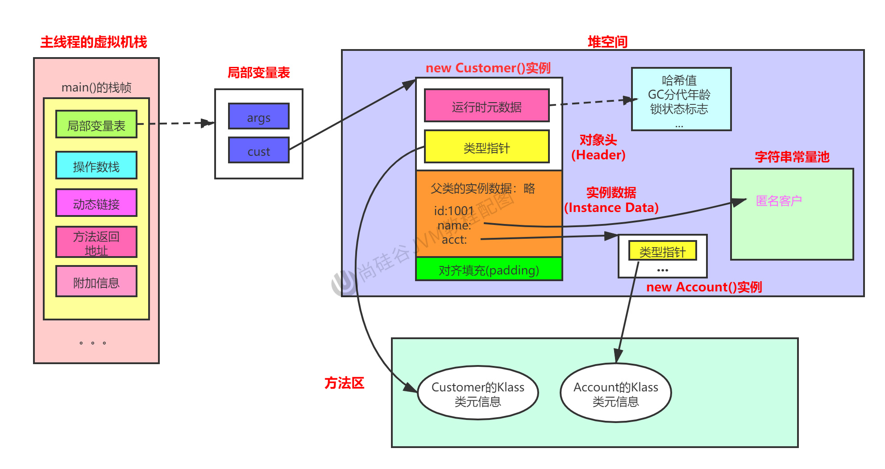
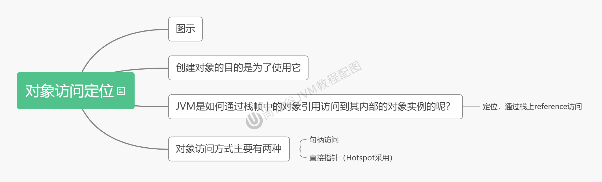

# Chapter10 对象的实例化内存布局与访问定位

## 10.1 对象的实例化

### 10.1.1 对象创建的方式
#### 1. new: 通过构造器 
1. 最常见的方式，直接new
2. 变形1: Xxx的静态方法，比如单例模式，实际也是通过new
3. 变形2: Xxx.Builder(), Xxx.Factory的静态方法

#### 2. Class的`newInstance()`
反射的方式，只能调用空参的构造器，权限必须是public

#### 3. Constructor的newInstance(Xxx)
反射的方式，可以调用空参、带参的构造器，权限没有要求

#### 4. 使用close()
不调用任何构造器，但是当前类需要实现clone()

#### 5. 使用反序列化
从文件中、网络中获得一个对象的二进制流

#### 6. 第三方库
比如 Objenesis

### 10.1.2 创建对象的步骤
* Example: `com.atguigui.java.ObjectTest`

#### 1. 判断对象对应的类是否加载、链接、初始化
JVM遇到一条new指令时，首先去检查这个指令的参数能否在Metaspace的常量池中定位到一个类的引用符号，并且检查这个符号引用代表的类是否已经被加载、解析和初始化，(即判断类元信息是否存在)。如果没有，那么在双亲委派模式下，使用当前类加载器以ClassLoader+包名+类名为Key进行查找对应的.class文件。如果没有找到文件，则抛出`ClassNotFoundException`异常；如果找到，则进行类加载，并生成对应的Class类对象。

#### 2. 为对象分配内存
首先计算对象占用空间大小，接着在堆中划分一块内存给新对象。如果实例成员变量是引用变量，仅分配引用变量空间即可，即4个字节大小。
1. 如果内存规整
   * 如果内存是规整的，那么虚拟机将采用的是指针碰撞法(Bump The Pointer)来为对象分配内存。意思是所有用过的内存在一遍，空闲的内存在另一边，中间放着一个指针作为分界点的指示器，分配内存就仅仅是把这个指针空闲的那边挪动一段与对象大小相等的距离罢了。如果垃圾收集器选择的是Serial, ParNew这种基于压缩算法的，虚拟机采用这种分配方式。一帮使用带有compact(整理)过程的收集器时，使用指针碰撞。
2. 如果内存不规整: 虚拟机需要维护一个列表
   * 如果内存是不规整的，已使用的内存和未使用的内存相互交错，那么虚拟机将采用的是空闲列表法来为对象分配内存。意思是虚拟机维护了一个列表，即路上哪些内存块是可用的，再分配的时候从列表中找到一块足够大的空间划分给对象实例，并更新列表上的内容。这种分配方式称为"空闲列表(Free lsit)"。

说明: 选择哪种分配方式由Java堆是否规整决定，而Java堆是否规整又由垃圾收集器是否带有压缩整理功能决定。 

#### 3. 处理并发安全问题
1. 采用CAS失败重试、区域加锁保证更新的原子性
2. 每个线程预先分配一块TLAB，通过`-XX:+/-UseTLAB`参数来设定 (在JDK8中默认使用TLAB)

#### 4. 初始化分配到的空间(默认初始化)
所有属性设置默认值，保证对象实例字段在不赋值时可以直接使用, (对象字段的默认初始化)

#### 5. 设置对象的对象头
将对象所属类(即类的元数据信息)，对象的HashCode和对象的GC信息、锁信息等数据存储在堆系那个的对象头中。这个过程的具体设置方式取决于JVM实现。

#### 6. 执行init方法进行初始化(显式初始化)
在Java程序的视角看来，初始化才正式开始，初始化成员变量，执行实例化代码块，调用类的构造方法，并把堆内对象的首地址赋值给引用变量。因此，一般来说(由字节码中是否跟有`invokespecial`指令所决定)，new指令之后接着就是执行方法，把对象按照程序员的意思进行初始化，这样一个真正可用的对象才算完全创建出来。

## 10.2 对象的内存布局

#### 1. 对象头(Header)
1. 运行时元数据: 
   1. 哈希值(HashCode)
   2. GC分代年龄
   3. 锁状态标志
   4. 线程持有的锁
   5. 偏向线程ID
   6. 偏向时间戳
2. 类型指针: 指向类元数据InstanceClass，确定该对象所属的类型

说明: 如果时数组，还需要记录数组的长度。

#### 2. 实例数据(Instance Data)
1. 说明: 它是对象真正存储的有效信息，包括程序代码中定义的各种类型的字段(包括从父类继承下来的和本身拥有的字段)
2. 规则:
   1. 相同宽度的字段总是被分配在一起
   2. 父类中定义的变量会出现在子类之前
   3. 如果CompactFields参数为true(默认为true): 子类的窄变量可能插入到父类变量的空隙

#### 3. 对齐填充(Padding)
不是必须的，也没有特别的含义，仅仅起到占位符的作用。

#### 4. 小结

## 10.3 对象的访问定位
JVM是如何通过栈帧中的对象引用访问到其内部的对象实例的？

对象访问的方式主要有两种
1. 句柄访问
   1. 
2. 直接指针(HotSpot采用)
   1. 

