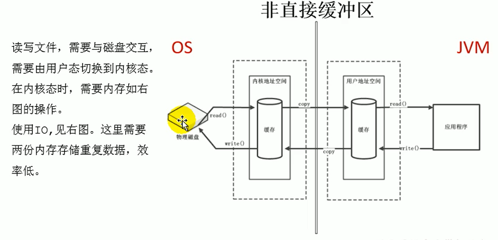
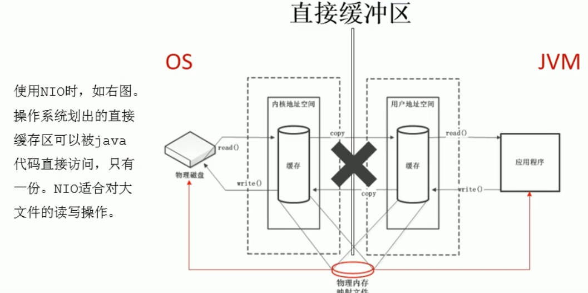
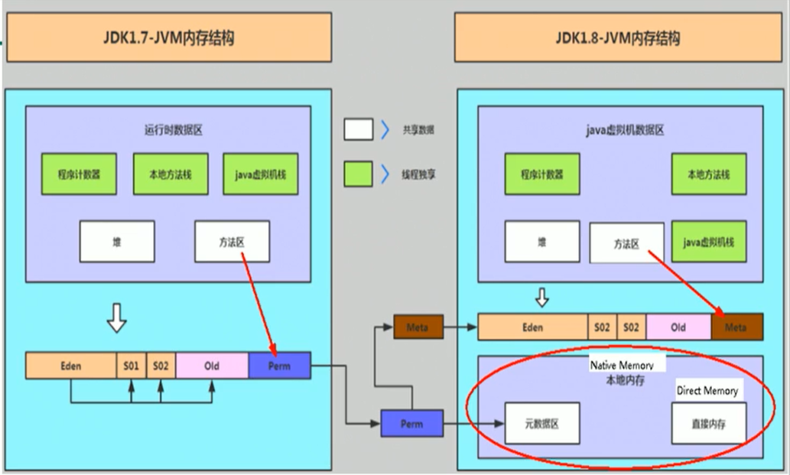

# Chapter11. 直接内存

## 11.1 直接内存概述
* 不是虚拟机运行时数据区的一部分，也不是《Java虚拟机规范》中定义的内存区域。
* 直接内存是Java堆外、直接向系统申请的内存区域
* 来源于NIO，通过存在堆中的DirectByteBuffer操作Native内存
* 通常，访问直接内存的速度会优于Java堆。即读写性能高
  * 因此，出于性能考虑，读写频繁的场合可能会考虑使用直接内存
  * Java的NIO库允许Java程序使用直接内存，用于数据缓冲区
  * 
  * 
* 也可能导致`OutOfMemoryError`异常
* 由于直接内存在Java堆外，因此它的大小不会直接受限于`-Xmx`指定的最大堆大小，但是系统内存是有限的，Java堆和直接内存的总和依然受限于操作系统能给的最大内存。
* 缺点:
  * 分配回收成本较高
  * 不受JVM内存回收管理
* 直接内存大小可以通过`MaxDirectMemorySize`设置
  * 如果不指定，默认与堆的最大值`-Xmx`参数值一致

