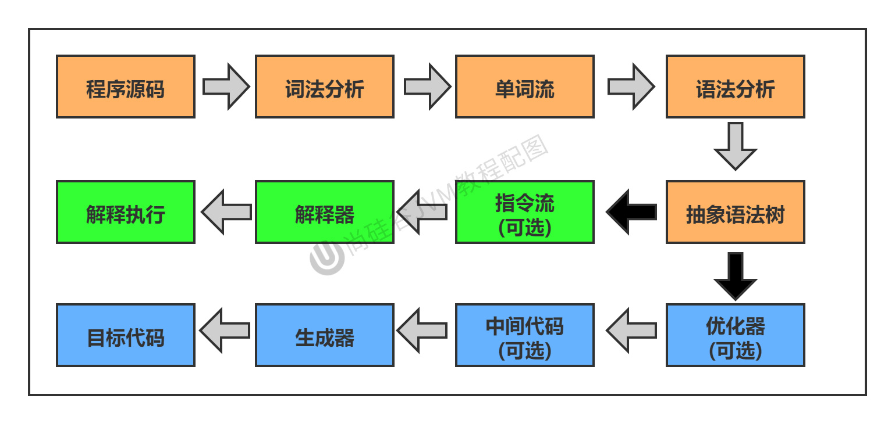
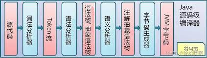
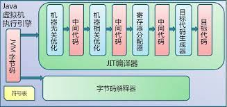
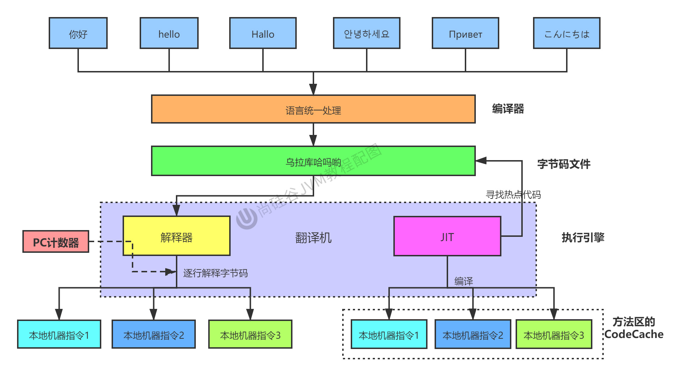
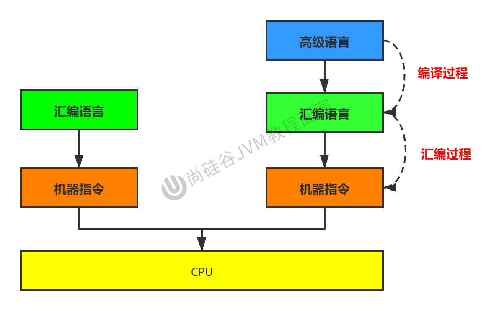
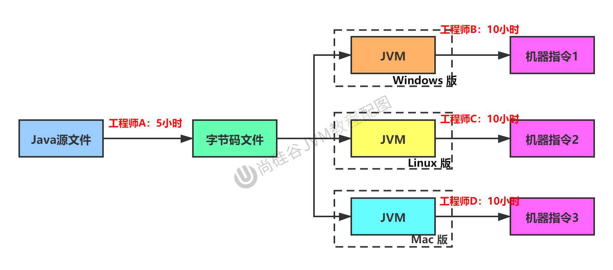
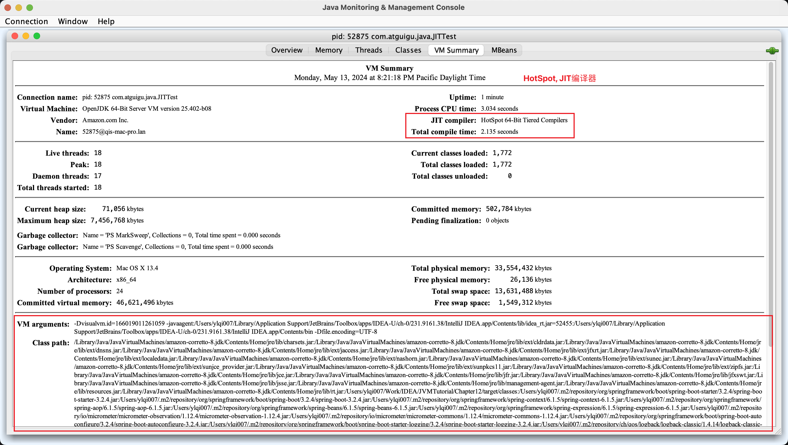

# Chapter12. 执行引擎 (Execution Engine)

## 12.1 执行引擎概述

* 执行引擎是Java虚拟机核心的组成部分之一。
* "虚拟机"是一个相对于"物理机"的概念，这两种机器都有代码执行能力。其区别是物理机的执行引擎是直接建立在处理器上、缓存、指令集和操作系统层面上的，而虚拟机的执行引擎则是由软件自行实现的，因此可以不受物理条件制约地定制指令集与执行引擎的结构体系，能够执行那些不被硬件支持的指令集格式。

JVM的主要任务是负责装载字节码到其内部，但字节码并不能够直接运行在操作系统之上，因为字节码指令并非等价于本地机器指令，它内部包含的仅仅是一些能够被JVM所识别的字节码指令、符号表，以及其他辅助信息。

那么，如果想要一个Java程序运行起来，执行引擎(Execution Engine)的任务就是**将字节码指令解释/编译为对应平台上的本地机器指令**才可以。简单来说，JVM中的执行引擎充当了高级语言翻译为机器语言的译者。

**执行引擎的工作过程:**
* 
  1. 执行引擎在执行的过程中究竟需要执行什么样的字节码指令完全依赖于PC寄存器。
  2. 每当执行完一项指令操作后，PC寄存器就会更新下一条需要被执行的指令地址。
  3. 当然方法在执行的过程中，执行引擎由可能会通过存储在局部变量表中的对象引用准确定位到存储在Java堆区中的堆的对象实例信息，以及通过对象头中的元数据指针定位到目标对象的类型信息。
* 从外观来看，所有的Java虚拟机的执行引擎输入、输出都是一致的: 输入的是字节码二进制流，处理过程是字节码解析执行的等效过程，输出的是执行结果。

## 12.2 Java代码编译和执行过程

大部分的程序代码换成物理机的目标代码或虚拟机能执行的指令集之前，都需要经过上图中的各个步骤。
* 橙色部分，前端编译器(javac)，生成字节码文件，此时跟JVM还没有关系
* 绿色，半解释型语言
* 蓝色，半编译型
* 绿色和蓝色才是JVM需要关注的

### 12.2.1 Java源码编译
Java代码编译是由Java源码编译器来完成的，流程图如下:

### 12.2.2 执行引擎

### 12.2.3 解释器 JIT编译器
问题: 什么是解释器(Interpreter), 什么是JIT编译器?
* 解释器: 当Java虚拟机启动时会根据规范对字节码采用逐行解释的方式执行，将每条字节码文件中的内容"翻译"为对应平台的本地机器指令执行。
* JIT(Just In Time Compiler)编译器: 就是虚拟机将源代码直接编译成和本地机器平台相关的机器语言。

问题: 为什么说Java是半编译半解释型语言？
* JDK1.0时代，将Java语言定位为"解释执行"还是比较准确的。在后来，Java也发展出来可以直接生成本地代码的编译器。
* 现在JVM在执行Java代码的时候，通常都会将解释执行与编译执行二者结合起来运行。

## 12.3 机器码、指令、汇编语言

### 12.3.1 机器码
* 各种用二进制编码方法表示的指令，叫做**机器指令码**。开始，人们就用它编写程序，这就是机器语言。(一系列01010101...)
* 机器语言虽然能够被计算机理解和接受，但是和人类的语言差别太大，不易被人理解和记忆，并且采用它编程容易出错且难以排查。
* 用它编写的程序一经输入计算机，CPU直接读取运行，因此和其他语言编写的程序相比，执行速度最快。
* 机器指令与CPU紧密相关，所以不同种类的CPU所对应的机器指令也就不同。

### 12.3.2 指令
**指令:**
* 由于机器码是由0和1组成的二进制序列，可读性是在太差，于是人们发明了指令。
* 指令就是把机器码中特定的0和1序列，简化成对应的指令(一般为英文简写，如mov, inc等)，可读性稍好。
* 由于不同的硬件平台，执行同一个操作，对应的机器码可能不同，所以不同的硬件平台的同一种指令(比如mov)，对应的机器码也可能不同。

**指令集:**
* 不同的硬件平台，各自支持的指令，是有差别的。因此每个平台所支持的指令，称之为对应平台的指令集。
* 如常见的:
  * x86指令集，对应的是x86架构的平台
  * ARM指令集，对应的是ARM架构平台

### 12.3.3 汇编语言
* 由于指令的可读性还是太差，于是人们有发明了汇编语言。
* 在汇编语言中，用助记符(Mnemonics)代替机器指令的操作码，用地址符号(Symbol)或标号(Label)代替指令或操作数的地址。
* 在不同的硬件平台，汇编语言对应着不同的机器语言指令集，通过汇编过程转换成机器指令。
  * 由于计算机只认识指令码，所以用汇编语言编写的程序还必须翻译成机器指令码，计算机才能识别和执行。

### 12.3.4 高级语言
* 为了使计算机用户编程更容易，后来就出现了各种高级计算机语言。高级语言比机器语言、汇编语言更接近人的语言。
* 当计算机执行高级语言编写的程序时，仍然需要把程序解释和编译成机器的指令码。完成这个过程的程序就叫做**解释程序**或**编译程序**。

### 12.3.5 字节码
* 字节码是一种中间状态(中间码)的二进制代码(文件)，它比机器码更抽象，需要直译器转译后才能称为机器码。
* 字节码主要为了实现特定软件运行和软件环境、与硬件环境无关。
* 字节码的实现方式是通过编译器和虚拟机器。编译器将源码编译成字节码，特定平台上的虚拟机器将字节码转译为可以直接执行的指令。
  * 字节码的典型应用为Java bytecode。

## 12.4 解释器
JVM设计者们的初衷仅仅是单纯为了满足Java程序实现跨平台特性，因此避免采用静态编译的方式直接生成本地机器指令，从而诞生了实现解释器在运行时采用逐行解释字节码执行程序的想法。

* 解释器真正意义上所承担的角色就是一个运行时"翻译者"，将字节码文件中的内容"翻译"为对应平台的本地机器指令执行。
* 当一条字节码指令被解释执行完成后，接着再根据PC寄存器中记录的下一条需要被执行的字节码指令执行解释操作。

在Java的发展历史中，一共有两套解释执行器，即古老的字节码解释器，现在普遍使用的模板解释器。

**现状:**
* 由于解释器在设计和实现上非常简单，因此除了Java语言之外，还有许多高级语言同样也是基于解释器执行的，比如Python、Perl、Ruby等。但是在今天，基于解释器执行已经沦为了低效的代名词，并且时常被一些C/C++程序员所调侃。
* 为了解决这个问题，JVM平台支持一种叫做即时编译的技术。即时编译的目的是为了避免函数被解释执行，而是将整个函数编译成机器码，每次函数执行时，只执行编译后的机器码即可，这种方式可以使执行效率大幅度提升。
* 不过无论如何，基于解释器的执行模式仍然为中间语言的发展做出了不可磨灭的贡献。

## 12.5 JIT编译器
### 12.5.1 Java代码的执行分类
1. 第一种是将源代码编译成字节码文件，然后在运行时通过解释器将字节码文件转为机器码执行。
2. 第二种是编译执行(直接编译成机器码)。现在虚拟机为了提高执行效率，会使用即时编译技术(JIT, Just In Time)将方法编译成机器码后再执行。

* HotSpot VM是目前市面上高性能虚拟机的代表作。它采用了解释器与即时编译器并存的构架。在Java虚拟机运行时，解释器和即时编译器能够相互协作，各自取长补短，尽力去选择最合适的方式来权衡编译本地代码的时间和直接解释执行代码的时间。
* 在今天，Java程序的运行性能早已经脱胎换骨，已经达到饿了可以和C/C++程序一较高下的地步了。

### 12.5.2 为什么还要保留解释器？
当程序启动后，**解释器**可以马上发挥作用，省去编译的时间，立即执行。**编译器**想要发挥作用，把代码编译成本地代码，需要一定的执行时间。但编译为本地代码后，执行效率高。

JRockit VM内部就不包含解释器，字节码全部都依靠即时编译器编译后执行。

### 12.5.3 HotSpot JVM的执行方式
当虚拟机启动的时候，解释器可以首先发挥作用，而不必等待即时编译器全部编译完后再执行，这样可以省去许多不必要的编译时间。并且随着程序运行时间推移，即时编译器逐渐发挥作用，根据热点探索功能，将有简直的字节码编译为本地机器指令，以换取更高的程序执行效率。

### 12.5.4 热点代码及探测方式

### 12.5.5 HotSpot VM中JIT分类
在HotSpot VM中内嵌有两个JIT编译器，分别为Client Compiler和Server Compiler，但大多数情况下简称为C1编译器和C2编译器。开发人员可以通过如下命令显式执行Java虚拟机在运行时到底使用哪一种即时编译器，如下所示
* `-client`: 指定Java虚拟机运行在Client模式下，并使用C1编译器；
  * C1编译器会对字节码进行简单可靠的优化，耗时短。以达到更快的编译速度。
* `-server`: 执行Java虚拟机在Server模式下，并使用C2编译器。
  * C2进行耗时长的优化，以及激进优化。但优化的代码执行效率更高。