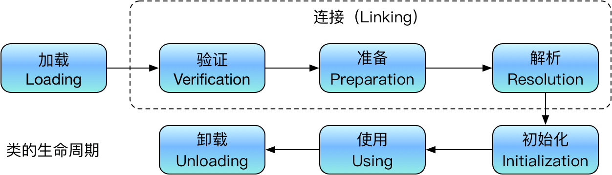

# Chap07 虚拟机类加载机制

## 7.1 概述
在class文件中描述的各种信息，最终都需要加载到虚拟机中之后才能被运行和使用。

Java虚拟机把描述类的数据从class文件中加载到内存，并对数据进行校验、转换解析和初始化，最终形成可以被虚拟机直接使用的Java类型，这个过程被称为**虚拟机的类加载机制**。

与一些在编译时需要进行链接的语言不同，在Java语言中，类型的加载、链接和初始化过程都是在程序运行过程期间完成的。

## 7.2 类加载的时机
**类的生命周期:** 一个类从被加载到虚拟机内存开始，到卸载出内存为之，它的整个生命周期将会经历加载、验证、准备、解析、初始化、使用和卸载七个阶段，其中验证、准备、解析三个部分统称为链接。

## 7.3 类加载的过程

### 7.3.1 加载
“加载”（Loading）阶段是整个“类加载”（Class Loading）过程中的一个阶段，希望读者没有混淆这两个看起来很相似的名词。在加载阶段，Java虚拟机需要完成以下三件事情：
1. 通过一个类的全限定名来获取定义此类的二进制字节流。
2. 将这个字节流所代表的静态存储结构转化为方法区的运行时数据结构。
3. 在内存中生成一个代表这个类的`java.lang.Class`对象，作为方法区这个类的各种数据的访问入口。

### 7.3.2 验证
验证是连接阶段的第一步， 这一阶段的目的是确保Class文件的字节流中包含的信息符合《Java虚拟机规范》的全部约束要求，保证这些信息被当作代码运行后不会危害虚拟机自身的安全。

### 7.3.3 准备
准备阶段是正式为类中定义的变量（即静态变量，被static修饰的变量）分配内存并设置类变量初始值的阶段，从概念上讲，这些变量所使用的内存都应当在方法区中进行分配，但必须注意到**方法区**本身是一个逻辑上的区域，
* 在JDK 7及之前，HotSpot使用永久代来实现方法区时，实现是完全符合这种逻辑概念的;
* 而在JDK 8及之后，类变量则会随着Class对象一起存放在**Java堆**中， 这时候“类变量在方法区”就完全是一种对逻辑概念的表述了。

### 7.3.4 解析
解析阶段是Java虚拟机将常量池内的符号引用替换为直接引用的过程。

### 7.3.5 初始化
类的初始化阶段是类加载过程的最后一个步骤，之前介绍的几个类加载的动作里，除了在加载阶
段用户应用程序可以通过自定义类加载器的方式局部参与外，其余动作都完全由Java虚拟机来主导控制。直到初始化阶段，Java虚拟机才真正开始执行类中编写的Java程序代码，将主导权移交给应用程序。