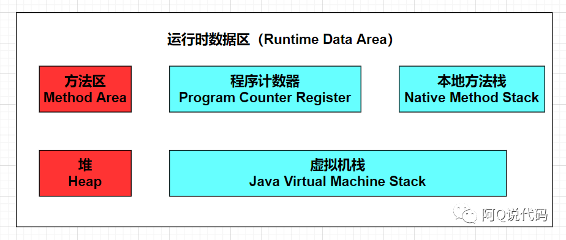
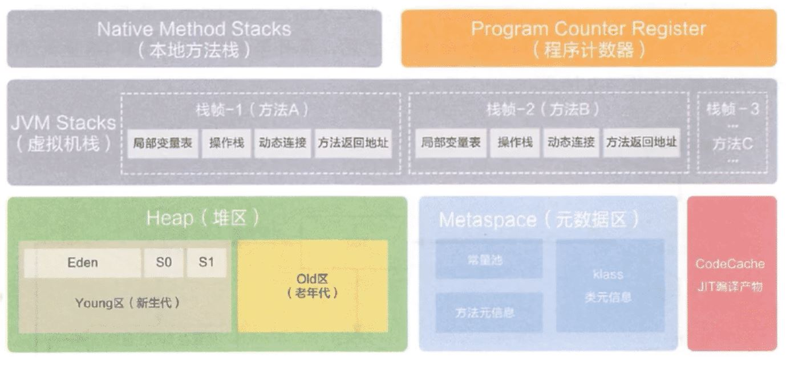

# Chap08 虚拟机字节码执行引擎

## 8.1 概述
**执行引擎**是Java虚拟机核心的组成部分之一。"**虚拟机**"是一个相对于"**物理机**"的概念，这两种机器都有代码执行能力，其区别是
* 物理机的执行引擎是直接建立在处理器、缓存、指令集和操作系统层面上，
* 而虚拟机的执行引擎则是由软件自行实现的，因此可以不受物理条件制约地定制指令集与执行引擎的结构体系，能够执行那些不被硬件直接支持的指令集格式。

## 8.2 运行时栈帧结构
Java虚拟机以**方法**作为最基本的执行单元，"**栈帧**"(Stack Frame)则是用于支持虚拟机进行**方法调用**和**方法执行**背后的数据结构，它也是虚拟机运行时数据区(Runtime Data Area)中的虚拟机栈(Java Virtual Machine Stack)的栈元素。栈帧存储了方法的局部变量表、操作数栈、动态链接和方法返回地址等信息。
每一个方法从调用开始至执行结束的过程，都对应着一个栈帧在虚拟机里的入栈和出栈的过程。

* 上图整体是**虚拟机运行时数据区(Runtime Data Area)**，包含5个部分。
* 右下角是**虚拟机栈(Java Virtual Machine Stack)**，

**每一个栈帧**的包括了
1. 局部变量表
2. 操作数栈
3. 动态链接
4. 方法返回地址
5. 一些额外信息

### 8.2.1 局部变量表
局部变量表(Local Variables Table)是一组变量值的存储空间，用于存放方法参数和方法内部定义的局部变量。
* 在Java程序被编译成class文件时，就在方法的Code属性的`max_locals`数据项中确定了该方法所需分配的局部变量表的最大容量。
* 局部变量表的容量以变量槽为最小单位。变量槽占用的存储空间为32bit(注意: 32bit并非《Java虚拟机规范》中明确规定的大小。《Java虚拟机规范》只是导向性地说每个变量槽都应该能存放一个boolean、byte、char、short、int、float、reference或returnAddress类型的数据，这8种数据都可以使用32bit或更小的物理内存来存储。)
  * reference类型表示对一个对象实例的引用。Java虚拟机规范中没有明确对顶reference类型的长度，它的长度与实际使用32bit还是64bit虚拟机有关，还与是否开启某些对象指针压缩的优化有关。
  * returnAddress类型目前已经很少见了，它是为字节码指令`jsr`, `jsr_w`和`ret`服务的，指向了一条字节码指令的地址，某些很古老的Java虚拟机曾使用这几条指令来实现异常处理时的跳转，但现在已经全部改为采用异常表来代替了。

### 8.2.2 操作数栈
操作数栈也常被称为操作栈，它是一个后入先出栈。同局部变量表一样，操作数栈的最大深度也在编译的时候被写入Code属性的`max_stacks`数据项之中。操作数栈的每一个元素都可以是包括`long`和`double`在哪的任意Java数据类型。32bit数据类型所占的栈容量为1，64bit数据类型所占的栈容量为2。Javac编译器的数据流分析工作保证了在方法执行的任何时候，操作数栈的深度都不会超过在`max_stacks`数据项中设定的最大值。

Java虚拟机的**解释执行引擎**被称为"基于栈的执行引擎"，里面的"栈"就是**操作数栈**。

### 8.2.3 动态链接
每个栈帧都包含一个指向**运行时常量池**中该栈帧所属方法的引用，持有这个引用是为了支持方法调用过程中的动态链接(Dynamic Linking)。class文件的常量池中存有大量的符号引用，字节码中的方法调用指令就是以常量池里指向方法的符号引用作为参数。
* 这些符号引用一部分会在类加载阶段或者第一次使用的时候就被转化为直接引用，这种转化被称为**静态解析**。
* 另外一部分将在每一次运行期间都转化为直接引用，这部分就被称为**动态链接**。

### 8.2.4 方法返回地址
### 8.2.5 附加信息

## 8.3 方法调用
方法调用并不等同于方法中的代码被执行，**方法调用阶段唯一的任务就是确定被调用方法的版本(即调用哪一个方法)**，暂时还未设计方法内部的具体运行过程。

一切方法调用在class文件中存储都只有符号引用，而不是方法在使劲运行时内存布局中的入口(也就是直接引用)。
* 这个特性增强了Java的动态扩展能力，但也使得Java方法调用过程变得相对复杂，某些方法调用需要在类加载期间，甚至到运行期间才能确定目标方法的直接引用。

### 8.3.1 解析(Resolution)
所有方法调用在目标方法在class文件里面都是一个常量池中的符号引用，在类加载的解析阶段，会将其中的一部分符号引用转化为直接引用，这种解析能够成立的前提是: 方法在程序的真正运行之前就有一个可确定的调用版本，并且这个方法的调用版本在运行期是不可改变的。换句话说，调用目标在程序代码写好、编译器进行编译的那一刻就已经确定下来。这类方法的调用过程被称为**解析(Resolution)**。

解析调用一定是个静态的过程，在编译期间就完全确定，在类加载的解析阶段就会把涉及的符号引用全部转变为明确的直接引用，不必延迟到运行期再去完成。

### 8.3.2 分派(Dispatch)
TODO

## 8.4 动态类型语言支持
随着JDK7的发布，Java虚拟机的字节码指令集增加了一条指令: `invokedynamic`。这条新增加的指令是JDK7的项目目标: 实现动态类型语言(Dynamically Typed Language)支持而进行的改进之一，也是为了JDK8里可以顺利实现Lambda表达式而做的技术储备。

### 8.4.1 动态类型语言
动态类型语言的关键特征是它的类型检查的主题过程是在运行期而不是编译期进行的。

### 8.4.2 Java与动态类型

### 8.4.3 `java.lang.invoke`包

### 8.4.4 `invokedynamic`指令

